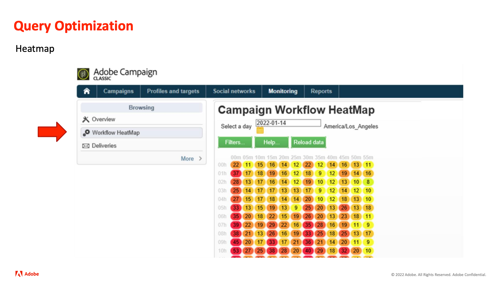
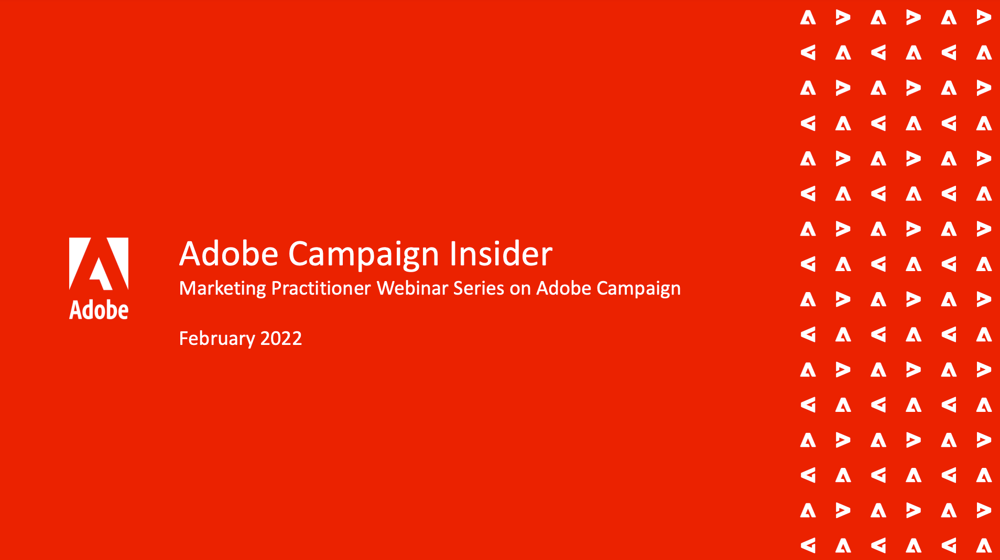

# Série Adobe Campaign Insider

Conseils et astuces pour les clients Adobe Campaign, et inspiration pour les aider à développer des stratégies marketing cross-canal, à améliorer les compétences des professionnels du marketing en équipe et à aider les entreprises à lancer des stratégies marketing cross-canal plus avancées.

>[!TIP]
>
>**Toutes les sessions enregistrées sont répertoriées dans le volet de navigation de gauche.**.

## En vedette

<table>
  <tr>
   <td>
      
      

         <a href="./2022/cross-channel.md"><strong>Améliorez votre marketing cross-canal avec Adobe Campaign Classic</strong></a>
          
      

   </td>
   <td>
      
      

         <a href="./2022/integrations.md"><strong>Intégrations d’Adobe Campaign à un écosystème marketing</strong></a>
          
      

   </td>
   <td>
      
      

         <a href="2022/tips.md"><strong>Conseils pour gagner du temps d’un professionnel</strong></a>
          
      

   </td>
</table>
