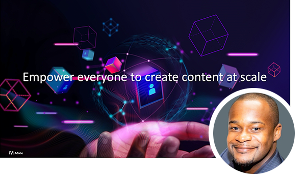
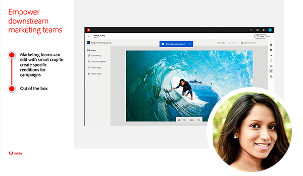
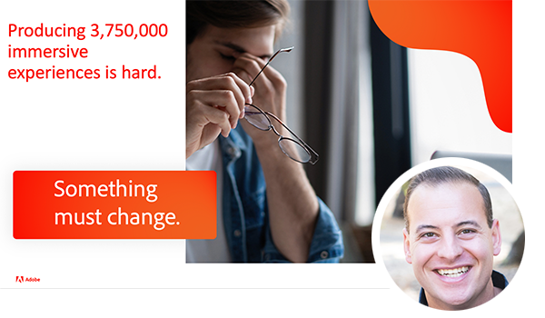

# Forum sur la gestion de contenu Adobe {#overview}

Apprenez des experts d’Adobe qui discutent de l’état actuel et futur de la stratégie de gestion de contenu, des livrables, des défis et des exigences techniques. Cet événement virtuel comprend une note d’orientation spéciale de Kurt Benkert, un quarterback de la NFL et un consultant en affaires, ainsi que Haresh Kumar, Director of Strategy and Product Marketing, puisqu’ils discutent de la manière dont la mise en place des outils adéquats peut vous aider à accéder aux ressources créatives et à simplifier les tâches quotidiennes, afin de déverrouiller la puissance de la vélocité du contenu.

Rejoignez les sessions ci-dessous pour apprendre :

* Comment moderniser la gestion de l’expérience pour démocratiser la création de contenu, rendre la diffusion omnicanal plus facile et mettre à l’échelle la personnalisation pour que chaque expérience compte.
* Comment créer une chaîne d’approvisionnement de contenu qui s’adapte à la personnalisation
* Comment accélérer le délai de mise sur le marché pour la création de sites et réduire la dépendance aux ressources techniques
* Les dernières innovations pour [!DNL Experience Manager] ont été proposées en tant que service cloud natif et vous permettent de vous adapter à des attentes du marché en constante évolution tout en restant en avance.
* Comment créer des sites plus rapidement avec Adobe [!DNL Experience Manager] comme système de gestion de contenu sans affichage, à l’aide de GraphQL et de fragments de contenu
* Bonnes pratiques pour les développeurs pour accélérer la mise sur le marché d’Adobe Experience Manager Sites

>[!TIP]
>
>**Toutes les sessions enregistrées sont répertoriées dans la navigation à gauche**.

<table>
  <tr>
   <td>
      
      

         <a href="2022/welcome.md"><strong>Adresse de bienvenue et AEM de présentation</strong></a>         
          <em> avec Elliot Sedegah, Haresh Kumar et Kurt Benkert</em>
      

      

         
         Bienvenue dans la série d’événements du forum de gestion de contenu Adobe. Dans cette vidéo, vous pouvez regarder l’adresse de bienvenue, obtenir un aperçu de l’AEM et entendre parler du déverrouillage de la vitesse du contenu.
      

   </td>
   <td>
      
      

         <a href="2022/assets-for-all.md"><strong>Extension de l'Adobe [!DNL Experience Manager] sans affichage avec Adobe [!DNL App Builder]</strong></a>         
          <em>avec Purnima Rachoor Roy</em>
      

      

         
          Découvrez comment [!DNL Assets Essentials] est le nouveau système [!DNL Digital Asset Management] pour les départements et les moyennes entreprises.
      

   </td>
   <td>
      
      

         <a href="2022/supply-chain.md"><strong> Création d’une chaîne d’approvisionnement de contenu à l’échelle </strong></a>         
          <em> avec Marc Angelinovich</em>
      

      

         
         Découvrez comment créer une chaîne d’approvisionnement de contenu qui s’adapte à la personnalisation.
      

   </td>
  </tr>
</table>
