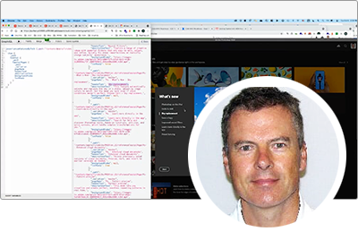
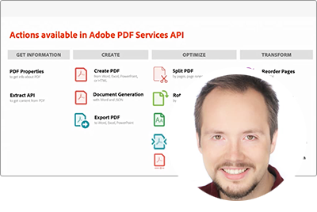
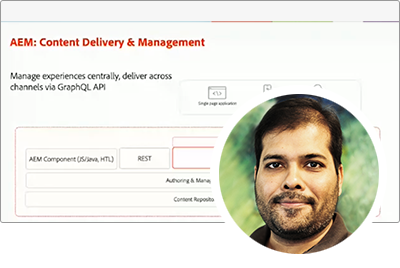
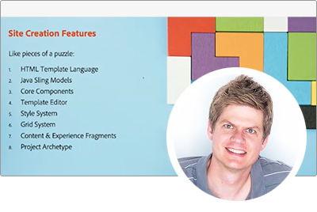
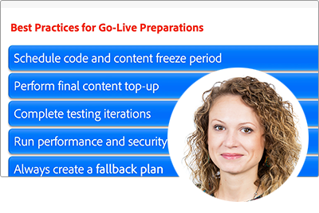

# Adobe Developers Live {#overview}

Adobe Developers Live rassemble des développeurs Adobe et des créateurs dʼexpériences aux profils variés autour dʼun objectif commun : créer dʼincroyables expériences de bout en bout. Cette conférence de deux jours présentera des mises à jour importantes pour les développeurs, des sessions techniques et des opportunités de réseautage communautaire.

Les équipes produit Adobe de Adobe Experience Cloud, Document Cloud et Creative Cloud présenteront les dernières avancées technologiques et les outils de développement qui optimisent la conception, les workflows de création de contenu, les services de document et la gestion de l’expérience client dans tous les secteurs.

Inscrivez-vous aux événements futurs **[here](https://developerevents.adobe.com/)**.

>[!TIP]
>
>**Toutes les sessions enregistrées sont répertoriées dans le volet de navigation de gauche.**.

## Octobre 2021

Les équipes produit Adobe de Adobe Experience Cloud, Document Cloud et Creative Cloud ont présenté les dernières avancées technologiques et les outils de développement qui permettent la conception, la création de contenu, les services de document et la gestion de l’expérience client dans tous les secteurs d’activité.

Découvrez tous les autres [sessions](2021/october/overview.md) !

<table>
  <tr>
   <td>
      
      

         <a href="2021/october/headless.md"><strong>Sites sans affichage</strong></a>         
          <em>avec Mathias Siegl, responsable produit principal, AEM Sites</em>
      

      

         
         Avec GraphQL pour les fragments de contenu disponibles pour AEM 6.5 et Adobe Experience Manager as a Cloud Service, découvrons comment Adobe Experience Manager peut être utilisé comme CMS sans interface.
      

     </td>   
     <td>
      
      

         <a href="2021/october/aep-integration.md"><strong>Présentation de l’intégration Adobe Experience Platform</strong></a>
          <em>avec Eric Knee, architecte principal en solutions d’entreprise</em>
      

      

         
         Cette session vous donnera une vue d’ensemble des différentes façons dont Adobe Experience Platform peut s’intégrer dans votre écosystème et des éléments à prendre en compte lors de la planification du travail d’intégration.
      

   </td>
   </td>
     <td>
      
      

         <a href="2021/october/pdf-services-api.md"><strong>Génération de documents et capture de signatures électroniques dans vos applications à l’aide de l’API Adobe Sign</strong></a>
          <em>avec Ben Vanderberg, évangéliste principal</em>
      

      

         
         L’API Adobe Document Generation est un puissant service de création de documents piloté par les modèles Microsoft Word fusionnés avec vos données. Lorsqu’ils sont combinés avec l’API Adobe Sign, les développeurs disposent d’un moyen facile de générer des documents dynamiques prêts à être traités par le biais du processus de signature.
      

   </td> 
  </tr>
</table>

## Février 2021

Cette conférence de deux jours a présenté des mises à jour importantes pour les développeurs d’Adobe Experience Manager, telles que Headless et GraphQL, Adobe Experience Manager as a Cloud Service, des sessions techniques et des opportunités de mise en réseau communautaire.

Découvrez tous les autres [sessions](2021/february/overview.md).

<table>
  <tr>
   <td>
      
      

         <a href="2021/february/headless-graphql-content-fragments.md"><strong>Sans affichage - GraphQL avec des fragments de contenu</strong></a>         
          <em>avec Jabran Asghar, ingénieur logiciel</em>
      

      

         
         Découvrez les nouvelles fonctionnalités sans interface avec les dernières améliorations apportées aux fragments de contenu. Cette session se concentrera sur l’API GraphQL pour AEM Cloud Service.
      

     </td>   
     <td>
      
      

         <a href="2021/february/rapid-frontend-devlopment.md"><strong>Développement frontal : votre futur workflow pour créer et déployer rapidement l’interface frontale de votre site.</strong></a>
          <em>avec Gabriel Walt, responsable produit</em>
      

      

         
         Utilisez les modèles de site pour créer de nouveaux sites en quelques clics, et pour vous remémorer le développement frontal grâce au déploiement rapide de ressources frontales telles que CSS&amp;JS.
      

   </td>
   </td>
     <td>
      
      

         <a href="2021/february/get-ready-aem-cloud.md"><strong>Préparez-vous pour le Cloud Service - Bonnes pratiques de migration</strong></a>
          <em>avec Andreea Moise, ingénieur logiciel</em>
      

      

         
         Pour optimiser les avantages d’AEM Cloud Service, il est essentiel d’adapter votre base de code afin qu’il soit compatible avec le cloud et pare-balles aux futures mises à niveau gérées sous le capot.
      

   </td>
  </tr>
</table>