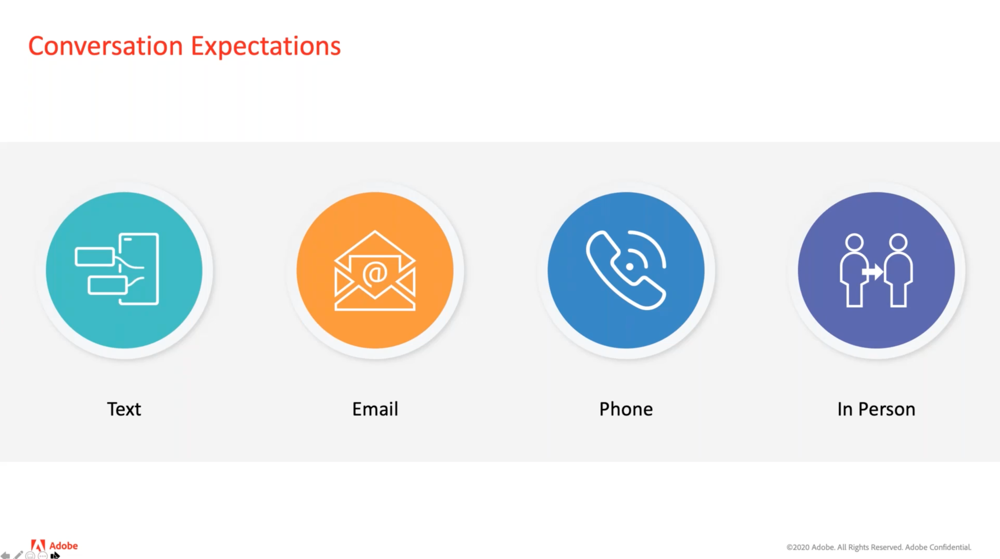
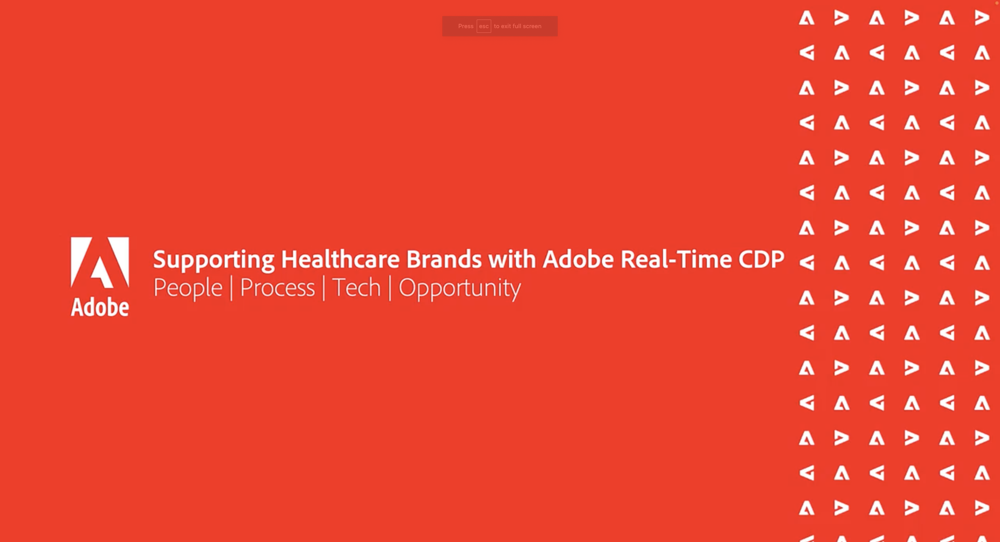
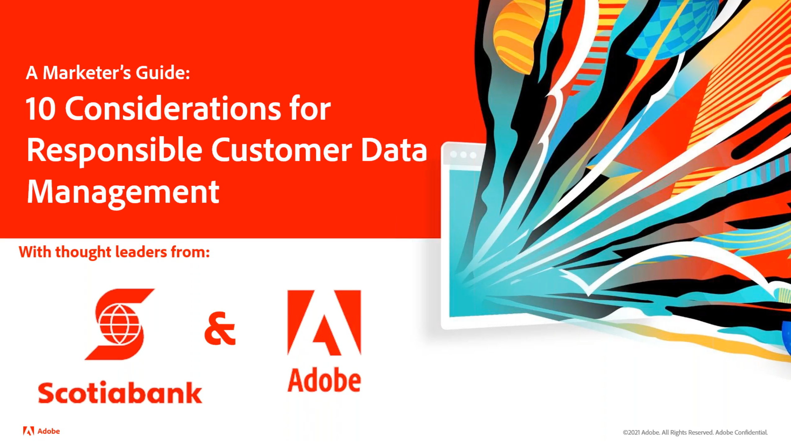
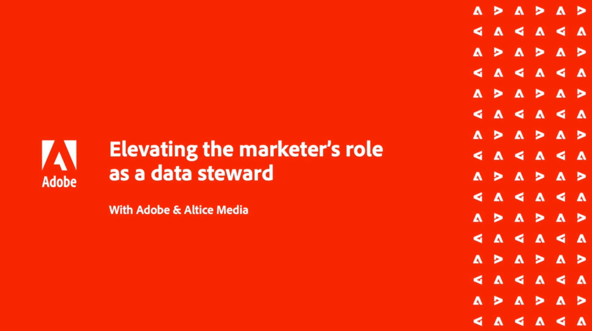
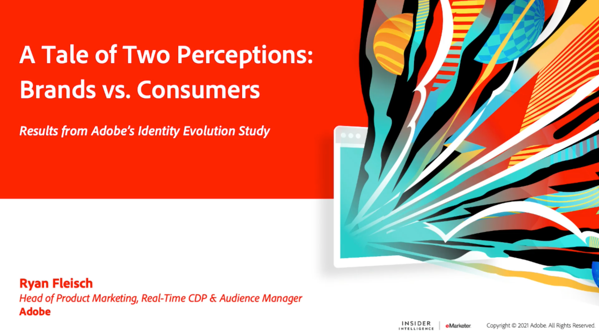

# Gestion des données client - Voix {#overview}

Bienvenue à la Gestion des données client Vois votre destination en tant que responsable et spécialiste de la gestion des données client et technique et des pratiques marketing. Cette page est votre guichet unique pour obtenir des nouvelles de vos pairs, vous inspirer et découvrir les développements dans le domaine du marketing. Aucune inscription requise, il vous suffit de cliquer et de regarder.

>[!TIP]
>
>**Toutes les sessions enregistrées sont répertoriées dans le volet de navigation de gauche.**.

## Blocs de création de la gestion des données client

<table>
  <tr>
   <td>
      
      

         <a href="./cdm/first-mile.md"><strong>Rationalisation de votre premier fichier de gestion des données</strong></a>
          
      

   </td>
   <td>
      
      

         <a href="./cdm/cdp-success.md"><strong>Sélection d’une plateforme de données client pour une réussite</strong></a>
          
      

    </td>
    <td>
      
      

         <a href="./cdm/people-and-process.md"><strong>Bonnes pratiques relatives à la plateforme de données clients - Personnes et processus</strong></a>
          
      

    </td>
   </tr>
   <tr> 
   <td>
      
      

         <a href="./cdm/evolving-your-audience-center-of-excellence.md"><strong>Évolution de votre centre d’excellence d’audience</strong></a>
          
      

    </td>
   <td>
      
      

         <a href="./cdm/building-better-experiences-with-customer-profiles.md"><strong>Amélioration des expériences avec les profils client</strong></a>
      

      

         
    </td>
   <td>
      
      

         <a href="./cdm/how-marketing-teams-are-improving-data-management-strategies.md"><strong>Amélioration des stratégies de gestion des données par les équipes marketing</strong></a>
      

      

      

    </td>
  </tr>
</table>

## Gouvernance et confidentialité des données d’audience et de profil

<table>
  <tr>
   <td>
      
      

         <a href="./governance/healthcare-shield.md"><strong>Adobe Real-time Customer Data Platform et Healthcare Shield</strong></a>
          
      

      

         
   </td> 
   <td>
      
      

         <a href="https://experienceleague.adobe.com/docs/platform-learn/tutorials/privacy/ten-considerations-for-responsible-customer-data-management.html"><strong>10 considérations à prendre en compte pour une gestion des données client responsable</strong></a>
          
      

      

         
    </td>
    <td>
      
      

         <a href="https://experienceleague.adobe.com/docs/platform-learn/tutorials/privacy/elevating-the-marketers-role-as-a-data-steward.html"><strong>Élever le rôle du marketeur en tant que responsable des données</strong></a>
          
      

      

         
       

    </td>
  </tr>
</table>

## Discussions sur le secteur

<table>
  <tr>
     <td>
      
      

         <a href="./industry/build-superb-experiences-with-your-first-party-data.md"><strong>Créer des expériences superbes avec vos données propriétaires</strong></a>
      

      

      

    </td>
     <td>
      
      

         <a href="./industry/data-collaboration-in-the-first-party-data-context.md"><strong>Collaboration en matière de données dans le contexte des données propriétaires</strong></a>
      

      

      

    </td>
     <td>
      
      

         <a href="./industry/the-future-of-data-management-and-the-changing-environment.md"><strong>L’avenir de la gestion des données et les changements d’environnement</strong></a>
      

      

      

    </td>
   <td>
      
      

         <a href="./industry/brands-vs-consumers.md"><strong>A Tale of Two Perceptions - Brands vs. Consumers (Double perception - Marques contre Consommateurs)</strong></a> 
      

    </td>
  </tr>
</table>
