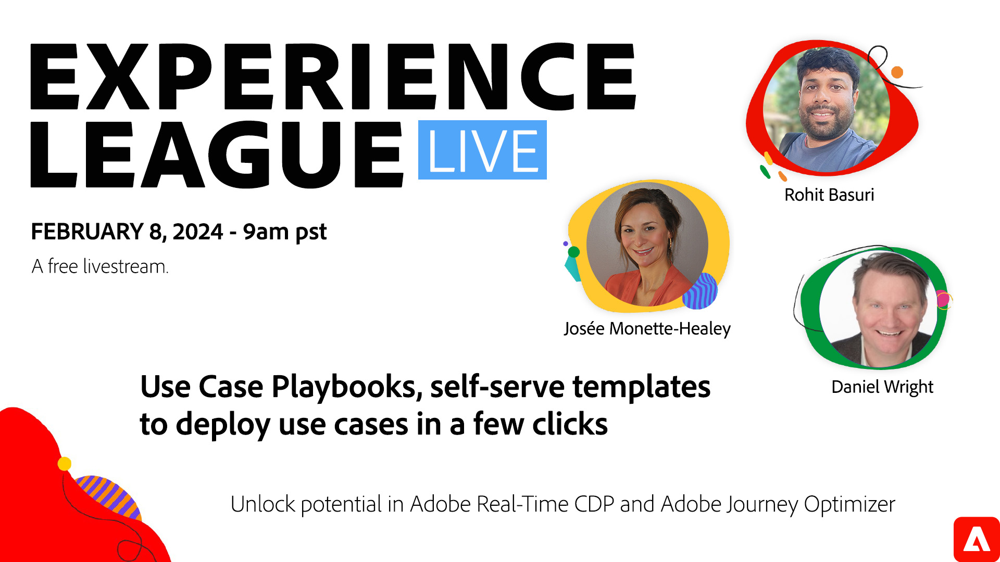

# Cas d’utilisation Playbooks, modèles en libre-service pour déployer des cas d’utilisation en quelques clics

Présentation des cahiers de travail des cas d’utilisation - un catalogue pratique des cahiers de travail des cas d’utilisation spécifiques au secteur dans Real-Time CDP et Journey Optimizer. Dans ce webinaire, vous découvrirez les guides de cas d’utilisation et la manière dont ils traduisent vos objectifs marketing en objets d’implémentation. Nous vous montrerons comment démarrer votre entreprise pour créer et déployer des cas d’utilisation connus pour accélérer l’impact sur l’entreprise et la collaboration.

**Cliquez sur l’image ci-dessus pour définir un rappel YouTube Live**.

