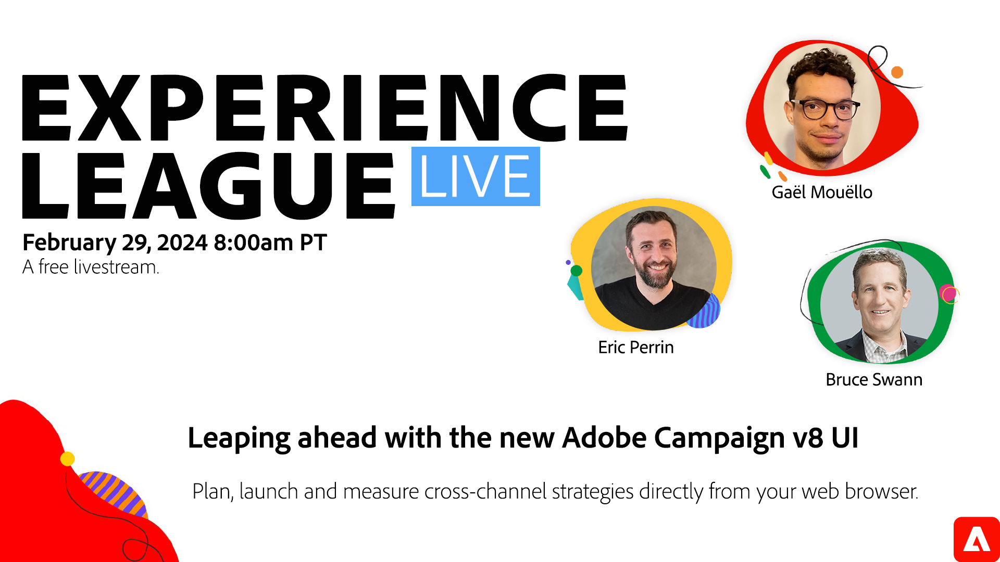

# Amélioration de l’interface utilisateur d’Adobe Campaign v8

Adobe Campaign v8 aura une toute nouvelle apparence. L’expérience utilisateur repensée simplifie le processus de conception de campagne et est cohérente avec les autres solutions Adobe Experience Cloud.

Rejoignez cette session en direct Experience League, où des experts du produit Adobe Campaign expliquent comment planifier, lancer et mesurer des campagnes cross-canal dans la nouvelle expérience utilisateur.

**Cliquez sur l’image ci-dessus pour définir un rappel YouTube Live.**