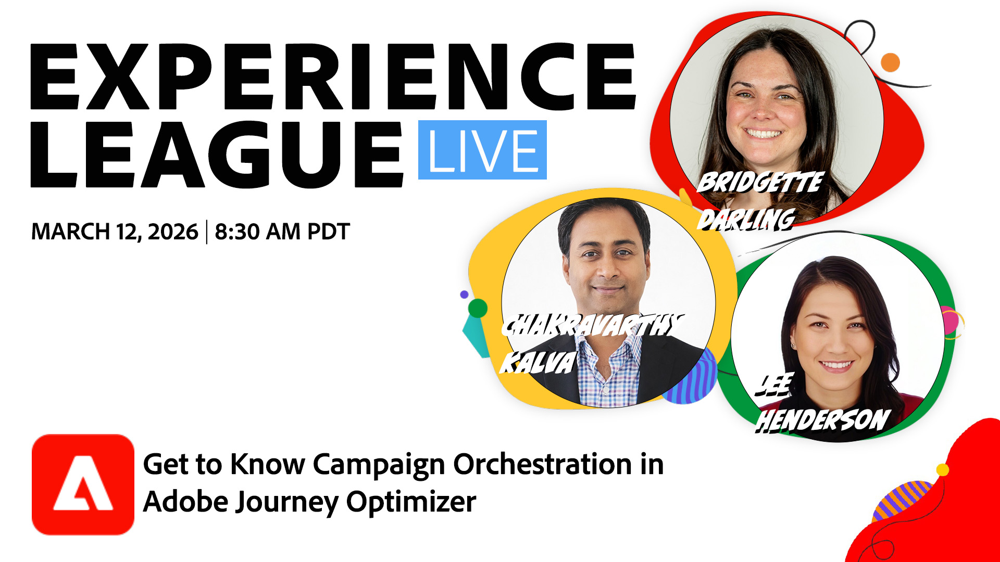

# Découvrir l’orchestration des campagnes dans Adobe Journey Optimizer

Découvrez comment l’orchestration des campagnes dans Journey Optimizer gère vos programmes marketing multicanaux volumineux et multiples, de la création d’audiences au lancement.

Nous aborderons la zone de travail d’orchestration des campagnes et les schémas relationnels, qui constituent la base de la gestion des campagnes complexes et des relations client, la segmentation d’entités multiples pour cibler les audiences appropriées sur des données complexes, l’affinement des audiences à la demande et le comptage par pré-envoi pour garantir la précision, ainsi que le fonctionnement transparent de cette fonctionnalité dans Journey Optimizer aujourd’hui.

[Inscrivez-vous dès aujourd’hui !](https://engage.adobe.com/ExpLeagueLive-260312.html){target="_blank"}
