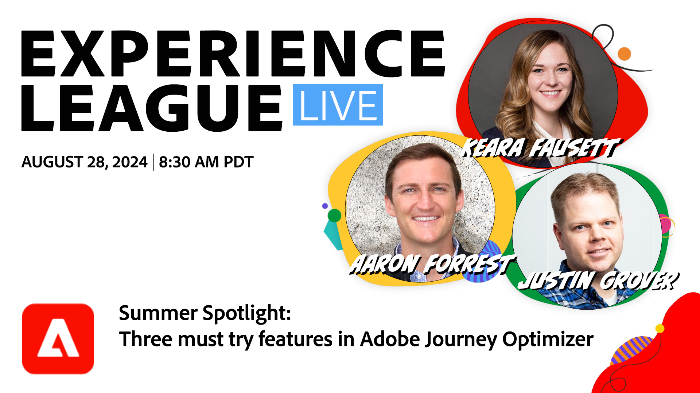

# Points phares de l’été - Il faut essayer les fonctionnalités de Adobe Journey Optimizer

Cet été, surchargez l’engagement de votre client grâce à Adobe Journey Optimizer qui dispose de trois fonctionnalités : expérimentation par parcours, limitation de la fréquence et messagerie multilingue.

**[Définir un rappel pour le programme sur YouTube](https://www.youtube.com/live/u_UEsl2Nw3M){target="_blank"}**

**Afficher les détails** :
Au fur et à mesure que l’été se réchauffe, les opportunités d’interaction avec vos clients se multiplient de manière nouvelle et impactée. Rejoignez-nous pour une expérience d’Experience League en direct d’une heure pour les utilisateurs de Journey Optimizer, que vous soyez impliqués dans des opérations marketing, la gestion de campagne/parcours ou dans l’expérience client, où nous vous proposons des fonctionnalités puissantes de Adobe Journey Optimizer.

Découvrez comment l’expérimentation par parcours peut vous aider à parfaire les interactions de vos clients pour obtenir des résultats optimaux sur vos parcours. Découvrez comment mettre en oeuvre le plafonnement de la fréquence afin d’éviter la sur-communication et de vous assurer que vos messages atteignent la marque. Découvrez les avantages de la messagerie multilingue pour vous connecter à différentes audiences dans leurs langues préférées.

Cet événement d’été améliorera vos stratégies marketing omnicanal et tirera le meilleur parti des opportunités d’engagement de la saison. Ne manquez pas cette occasion d’élever vos parcours client et vos campagnes afin de stimuler le succès avec Adobe Journey Optimizer.
