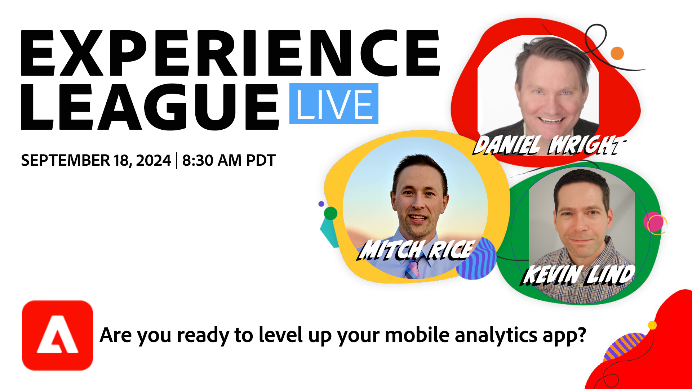

# Êtes-vous prêt à configurer votre application d’analyse mobile ?

Au cours de cette session, vous apprendrez à utiliser l’extension Edge Bridge pour combler le fossé entre les migrations. Nous vous fournirons des instructions détaillées sur la configuration de vos propriétés mobiles et la mise à jour de votre mise en oeuvre côté client pour utiliser Edge Bridge.

**[Définir un rappel pour le programme sur YouTube](https://www.youtube.com/live/QKz1slMT36Y){target="_blank"}**

**Afficher les détails** :
Vous avez utilisé Adobe Analytics dans votre application mobile pour obtenir des informations sur votre activité numérique et comprendre comment vos clients utilisent votre application.

Vous avez également entendu dire que la collecte de données Edge représente l’avenir de l’écosystème d’Adobe, ce qui vous permet d’exploiter d’autres solutions telles que Real-Time CDP, Journey Optimizer et Customer Journey Analytics.

Est-il possible de mettre à niveau votre application afin de conserver la mise en oeuvre existante pour Analytics et de migrer vers Adobe Experience Platform (AEP) à votre propre rythme ?

Au cours de cette session, vous apprendrez à utiliser l’extension Edge Bridge pour combler le fossé entre les migrations. Nous vous fournirons des instructions détaillées sur la configuration de vos propriétés mobiles et la mise à jour de votre mise en oeuvre côté client pour utiliser Edge Bridge.

Après la migration, vous pouvez toujours accéder à vos données dans Analytics, ce qui vous rapproche d’AEP. Vous n&#39;êtes toujours pas sûr ? Nous vous montrerons comment valider votre mise en oeuvre et déboguer en temps réel.
