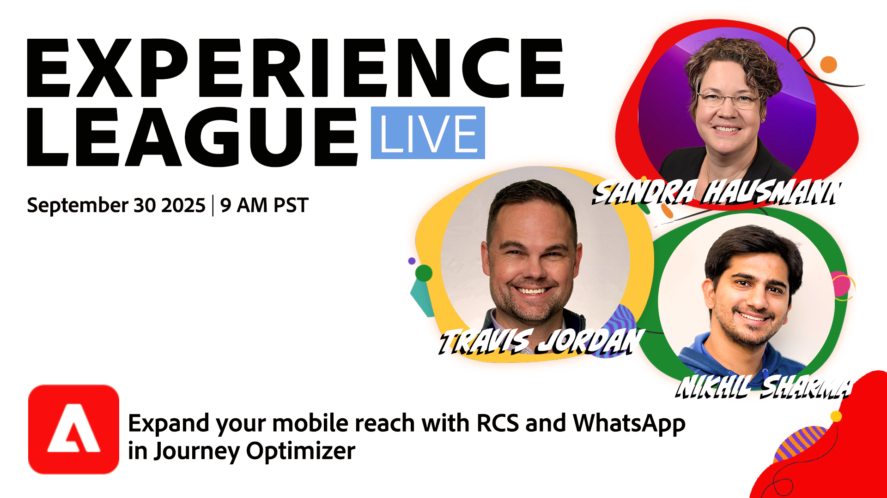

# Alimenter du contenu personnalisé dans Journey Optimizer avec des fragments de contenu AEM et Dynamic Media

Dans cette émission d’Experience League Live Show, Travis Jordan et Nikhil Sharma présenteront comment Adobe Journey Optimizer a récemment étendu l’engagement mobile grâce à de puissants ajouts et fonctionnalités de nouveaux canaux, notamment WhatsApp, RCS et le fournisseur de SMS personnalisé.

Découvrez comment diffuser des expériences mobiles riches et personnalisées qui vont au-delà du texte brut, avec des fonctionnalités telles que les boutons interactifs, les carrousels, les réponses rapides, etc., le tout orchestré directement dans Journey Optimizer avec ces nouveaux canaux. Nous allons passer en revue les avantages et les différences entre RCS et WhatsApp, passer en revue la configuration de ces nouveaux canaux, y compris les informations d’identification d’API et les webhooks, et la manière dont vous pouvez incorporer ces canaux dans votre stratégie d’engagement omnicanal existante.

> 

[Inscrivez-vous maintenant !](https://engage.adobe.com/ExpLeagueLive-250930.html)
