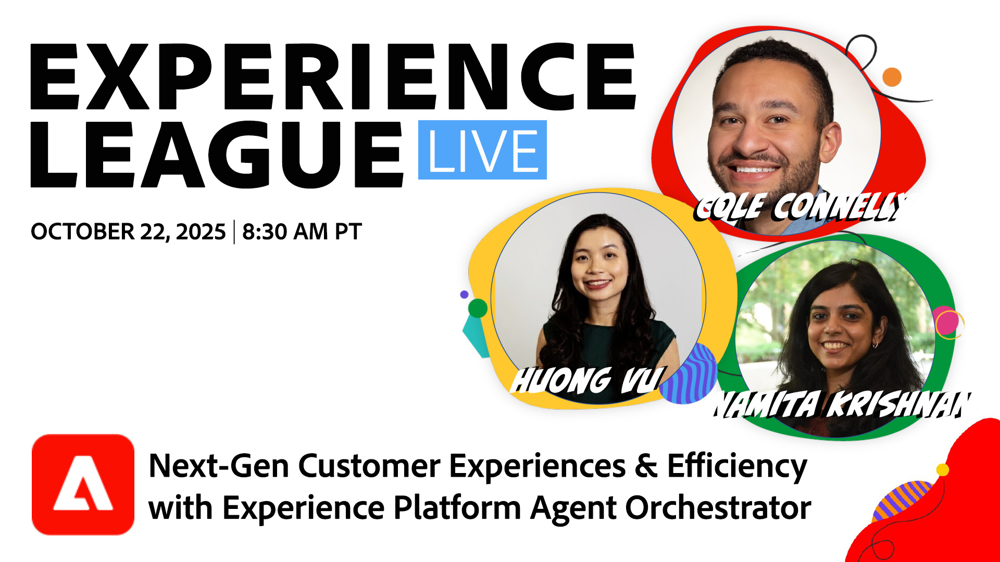

# Expériences client et efficacité nouvelle génération avec Adobe Experience Platform Agent Orchestrator

Adobe Experience Platform Agent Orchestrator est la nouvelle couche agentique d’Adobe Experience Platform. Conçu pour exploiter les données riches et les connaissances des clients de la plateforme, Experience Platform Agent Orchestrator alimente l&#39;intelligence et la logique derrière des agents Adobe Experience Platform experts spécialement conçus, leur permettant d&#39;exécuter des tâches complexes de prise de décision et de résolution de problèmes à vitesse et à l&#39;échelle, le tout avec une supervision humaine. Grâce à une interface de conversation comme l’assistant d’IA, les utilisateurs et utilisatrices pourront accéder à ces agents et à d’autres composants d’IA pour réaliser des gains de productivité et d’efficacité supérieurs.

Au cours de cette session, rejoignez l’équipe produit d’Experience Platform Agent Orchestrator qui explore les points suivants :

* Présentation d’Agent Orchestrator et de ses dernières mises à jour
* Comment Agent Orchestrator orchestre les agents experts pour fournir des résultats mesurables et prendre en charge les cas d’utilisation de bout en bout
* comment Agent Orchestrator offre la confiance, la transparence, la sécurité et les mécanismes de sécurisation dont les marques ont besoin pour adopter en toute confiance des solutions d’IA ;

[Inscrivez-Vous Maintenant !](https://engage.adobe.com/ExpLeagueLive-251022.html)
