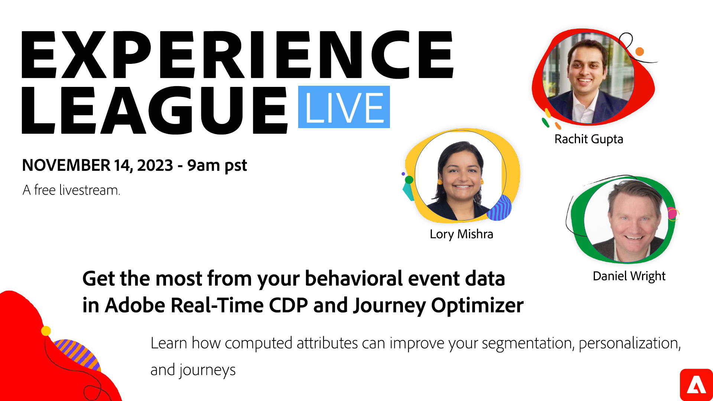

# Tirez le meilleur parti de vos données d’événement comportemental dans Real-Time CDP et Journey Optimizer

Découvrez comment créer des agrégats de données d’événement avec des attributs calculés afin d’améliorer la segmentation, la personnalisation et les parcours.

Les données comportementales sont un élément clé de la diffusion d’expériences client personnalisées, mais il peut s’avérer difficile d’exploiter pleinement ces données. Aujourd’hui, vous pouvez vous fier à des systèmes, des technologues et des ingénieurs de données distincts pour créer des agrégats significatifs de données comportementales afin de fournir des expériences remarquables.

Au cours de cette session en direct Experience League, des experts en produits vous montreront comment les &quot;attributs calculés&quot; dans Real-Time CDP et Journey Optimizer peuvent vous aider à utiliser une interface utilisateur simple pour créer des agrégats comportementaux en tant qu’attributs de profil pouvant être utilisés pour une segmentation et une personnalisation améliorées.

**Cliquez sur l’image ci-dessus pour définir un rappel pour l’événement livestream .**
