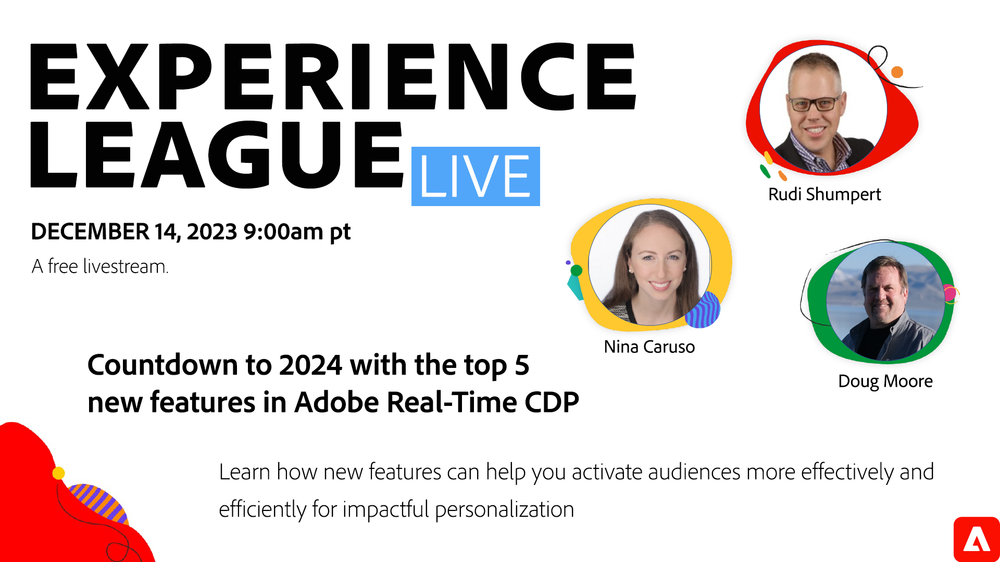

# Compte à rebours jusqu’en 2024 avec les 5 premières nouvelles fonctionnalités d’Adobe Real-Time CDP

Découvrez comment de nouvelles fonctionnalités peuvent vous aider à activer les audiences de manière plus efficace et plus efficace pour une personnalisation impactée.

Êtes-vous actuellement praticien de Real-Time CDP et à la recherche d’informations sur les nouveautés du produit, les raisons de son importance et la manière dont l’Adobe peut vous aider à améliorer vos stratégies de gestion des données client ? Ne cherchez pas plus loin - vous êtes au bon endroit ! Dans cette série, nous allons approfondir ce qui a été récemment lancé dans Real-Time CDP afin que vous puissiez tirer parti des nouveautés et avoir un impact sur votre organisation.

Au cours de cette session, nous aborderons et présenterons cinq nouvelles fonctionnalités qui ont été lancées au cours des derniers mois :

1. Attributs calculés
2. Prise en charge des données du partenaire
3. Notre nouvelle structure d’audience
4. Audiences similaires
5. Nouvelles destinations, y compris LiveRamp

À partir de cette session, vous devez vous attendre à :

* Comprendre le fonctionnement pratique de ces fonctionnalités au moyen d’une démonstration en direct
* Découvrez pourquoi ces fonctionnalités ont un impact, ce qui vous permet d’être efficace et utile en tant que praticien.
* Pouvoir commencer à exploiter ces nouvelles fonctionnalités dès aujourd’hui
* Améliorez dès aujourd’hui vos efforts de personnalisation client !

Comme toujours, cette session en direct permet de poser des questions dans la conversation et d&#39;obtenir les réponses des experts.

**Cliquez sur l’image ci-dessus pour définir un rappel pour le programme.**.
