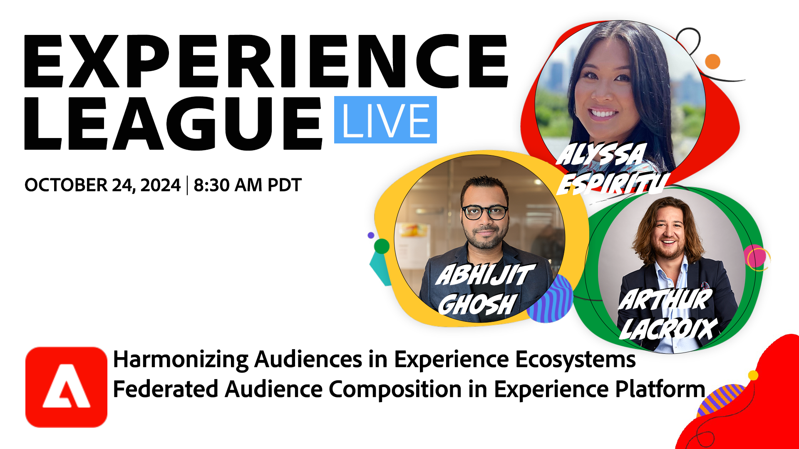

# Harmonisation des audiences dans les écosystèmes de l’expérience - Composition de l’audience fédérée en Experience Platform

Découvrez comment la composition d’audiences fédérées offre une approche complète du traitement et de l’activation des audiences avec Real-Time CDP et Journey Optimizer.

[Inscrivez-vous à cet événement](https://engage.adobe.com/ExpLeagueLive-241024.html)

**Afficher les détails** :
Accédez aux entrepôts de données d’entreprise pour composer des audiences et optimiser les expériences lancées sur la marque et en temps réel.

Au cours de cette session, vous apprendrez à :

* Accédez aux jeux de données critiques basés sur l’entrepôt sans copier de données sous-jacentes afin de minimiser la duplication.
* Composer et enrichir des audiences à forte valeur ajoutée à l’aide de jeux de données basés sur l’entrepôt.
* Activez ces audiences sur plusieurs canaux afin de prendre en charge les cas d’utilisation de faible latence et d’optimiser les expériences personnalisées.
