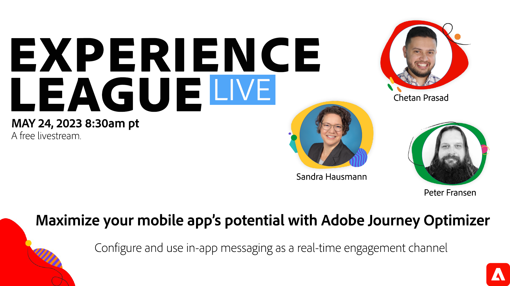

# Optimiser le potentiel de votre application mobile avec Adobe Journey Optimizer

Découvrez les avantages de la messagerie in-app en tant que canal d’engagement en temps réel et comment configurer et créer des expériences d’application mobile personnalisées dans Adobe Journey Optimizer.

Cliquez sur l’image ci-dessus pour accéder à la page d’affichage de YouTube.
