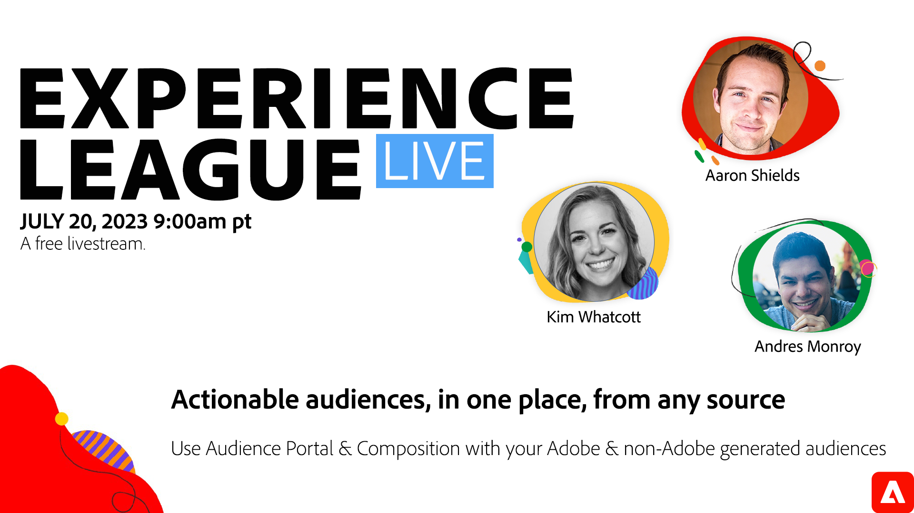

# Audiences exploitables, à un emplacement &#x200B;, issues de n’importe quelle source, avec contrôles standard

Les nouvelles fonctionnalités Portail d’audience et Composition ont porté la segmentation et la gestion de l’audience dans Real-Time CDP à un tout nouveau niveau. L’ingestion d’audiences préconfigurées, la gestion centralisée de l’audience et un nouveau canevas de composition vous permettent de créer, d’organiser et de distribuer vos audiences clés sur plusieurs canaux marketing.

Cliquez sur l’image ci-dessus pour vous inscrire à l’événement. On se voit là !
