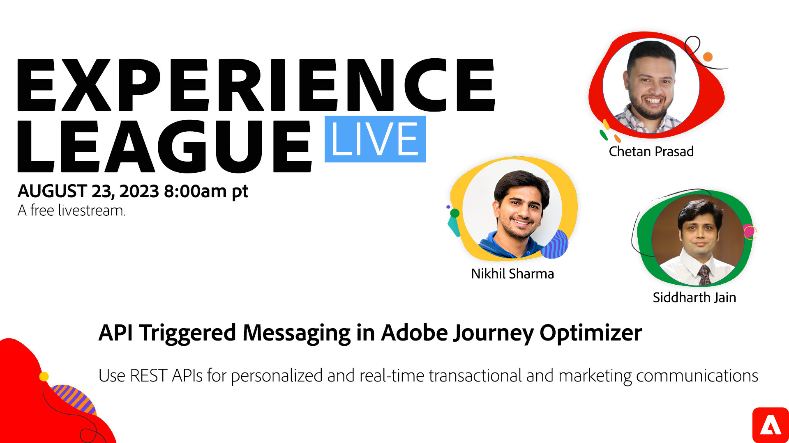

# Messagerie déclenchée par l’API dans Adobe Journey Optimizer

Découvrez comment utiliser les API REST pour les communications transactionnelles et marketing contextuelles, personnalisées et en temps réel.

Bien que Adobe Journey Optimizer offre une interface et un workflow modernes et conviviaux pour créer et gérer des parcours client 1:1 personnalisés en temps réel, les entreprises doivent également communiquer des messages sensibles au temps et essentiels à la mission en fonction de signaux urgents et de créer des messages à l’intention des audiences sans créer de parcours. Ces messages peuvent inclure des réinitialisations de mot de passe, des codes ponctuels, ou même des mises à jour après jeu pour les abonnés de la base des fans sportifs.

Avec les campagnes déclenchées par l’API, les entreprises peuvent définir une campagne et l’utiliser plusieurs fois pour diffuser des messages personnalisés avec des informations contextuelles en temps réel en se déclenchant via l’API REST.

Lors de cette session en direct Experience League, des experts Adobes vous expliqueront comment exécuter des cas d’utilisation transactionnelle et marketing avec les fonctionnalités de messagerie déclenchée de l’API dans AJO.

**Cliquez sur l’image ci-dessus pour définir un rappel pour le programme.**
