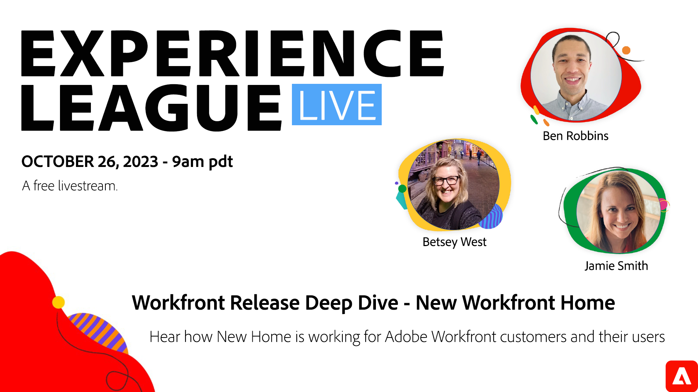

# Experience League LIVE

Experience League LIVE est une émission produite par l’équipe d’Experience League et diffusée en direct.  Elle vous offre la possibilité d’entrer en contact avec des experts en produits Adobe et de découvrir des conseils pratiques, des astuces et des stratégies à mettre en pratique avec les applications Adobe Experience Cloud.

## Événements LIVE Experience League à venir

<table>
<tr>
  <td style="vertical-align: top;">
    

      <a href="episodes/exl-live-episode-10-26-23.md">
        <strong>Workfront Release Deep Dive - Nouvelle page d’accueil Workfront</strong>
      </a>
       <em>avec Betsey West, Ben Robbins et Jamie Smith</em>
       <em>26 octobre 2023</em>
    

  </td>
</tr>
</table>

## Choix du personnel

<table style="max-width: 1214px;">

<tr>
  <td style="vertical-align: top;">
    

      <a href="/help/experience-league-live/episodes/exl-live-episode-04-21-22.md">
        <strong>AEM de Headless à Headless</strong>
      </a>
       <em>avec Danny Gordon, Amol Anand, Sachin Mali et Sean Steimer</em>
       <em>21 avril 2022</em>
    

  </td>

<td style="vertical-align: top;">
    
    

      <a href="episodes/exl-live-episode-08.md"><strong>Customer Journey Analytics - L'école intérieure</strong></a>
       <em>avec Trevor Paulsen, Rohit Gossain, Alex Strawn</em>
       <em>25 janvier 2021</em>
    

  </td>

<td style="vertical-align: top;">
    
    

      <a href="episodes/exl-live-episode-05-26-22.md">
        <strong>Demandez aux experts : Principes de base du SDK Web</strong>
      </a>
       <em>avec Rudi Shumpert, Jeff Chasin et Eric Matisoff</em>
       <em>26 mai 2022</em>
    

  </td>
  </tr>

</table>

>[!TIP]
>
>Pour découvrir des méthodes d’apprentissage supplémentaires, consultez nos [cours](https://experienceleague.adobe.com/?lang=fr#dashboard/learning) gratuits ainsi que nos [tutoriels](https://experienceleague.adobe.com/docs/home-tutorials.html?lang=fr) individuels.
