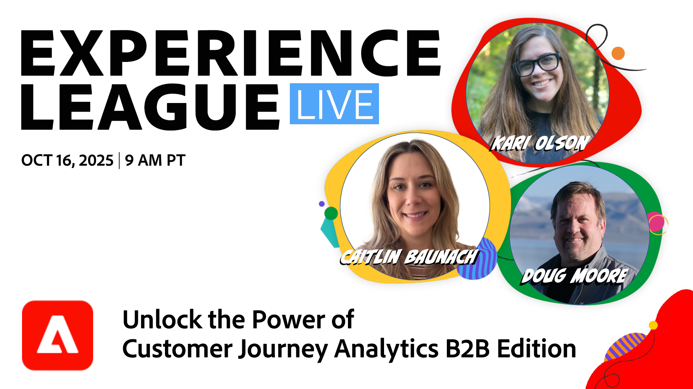
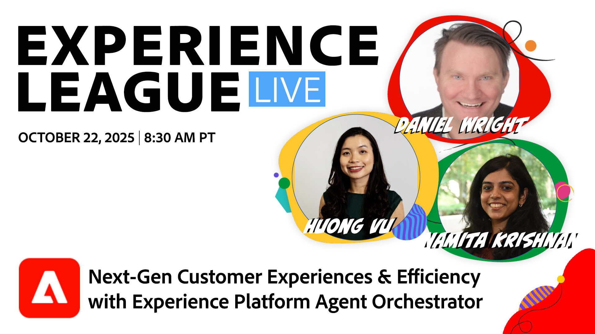
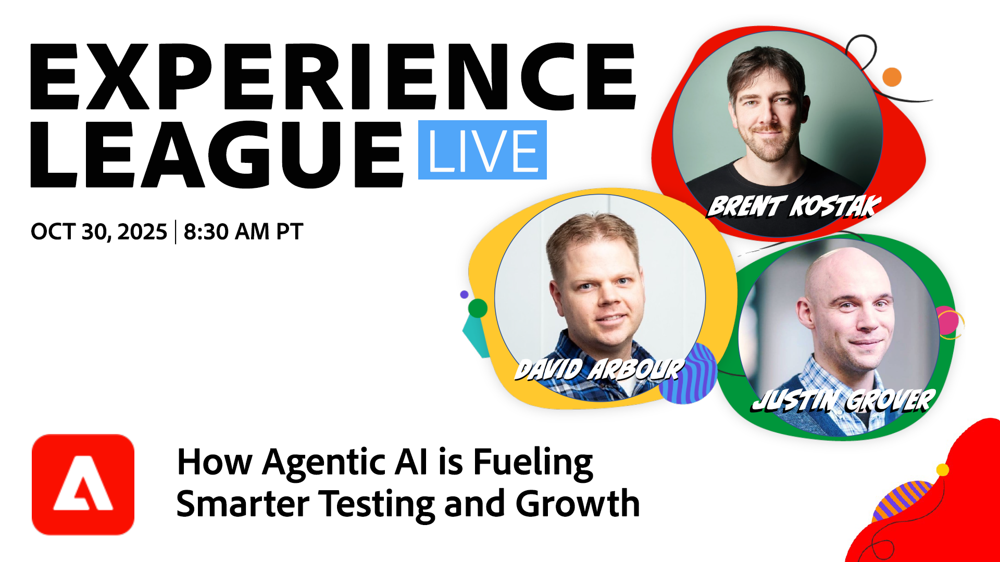
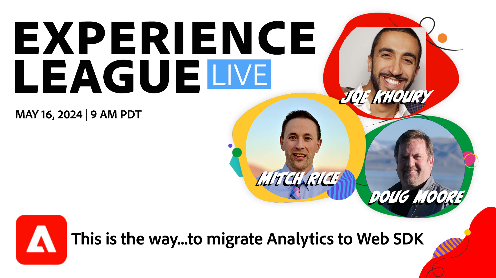
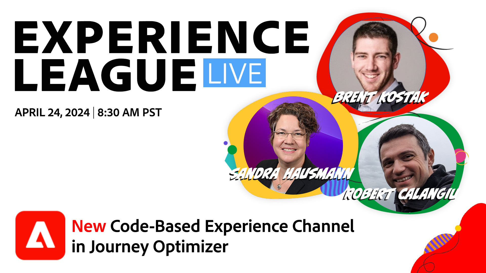

# Experience League LIVE

Experience League LIVE est une émission produite par l’équipe d’Experience League et diffusée en direct.  Elle vous offre la possibilité d’entrer en contact avec des expertes et experts en produits Adobe et de découvrir des conseils pratiques, des astuces et des stratégies à mettre en pratique avec les applications Adobe Experience Cloud.

## Événements Experience League LIVE à venir

<table>
    <tr>
        <td style="vertical-align: top;">
            

              <a href="episodes/exl-live-episode-10-16-25.md">
                <strong>Tirer parti de la puissance de Customer Journey Analytics B2B edition</strong>
              </a>
               <em>avec Doug Moore, Kari Olson, Caitlin Baunach</em>
               <em>16 octobre 2025</em>
            

        </td>
        <td style="vertical-align: top;">
            

              <a href="episodes/exl-live-episode-10-22-25.md">
                <strong>Expériences client et efficacité nouvelle génération avec Adobe Experience Platform Agent Orchestrator</strong>
              </a>
               <em>avec Daniel Wright, Namita Krishnan et Huong Vu</em>
               <em>2 octobre 2025</em>
            

        </td>
         <td style="vertical-align: top;">
            

              <a href="episodes/exl-live-episode-10-22-25.md">
                <strong>La prochaine ère d'expérimentation : comment l'IA agentique alimente des tests et une croissance plus intelligents</strong>
              </a>
               <em>avec Sandra Hausmann, Brent Kostak, Justin Grover et David Arbor</em>
               <em>30 octobre 2025</em>
            

        </td>
    </tr>

</table>

## Choix du personnel

<table style="max-width: 1214px;">

<tr>
  <td style="vertical-align: top;">
    

      <a href="episodes/exl-live-episode-06-26-24.md">
        <strong>Comment les dernières versions d’Adobe Real-Time CDP peuvent faire avancer votre entreprise</strong>
      </a>
       <em>avec Nina Caruso, Rudi Shumpert et Doug Moore</em>
       <em>26 juin 2024</em>
    

  </td>

<td style="vertical-align: top;">
    
    

      <a href="episodes/exl-live-episode-05-16-24.md"><strong>C’est ainsi que...vous pouvez migrer Analytics vers Web SDK</strong></a>
       <em>avec Mitch Rice, Joe Khoury et Doug Moore</em>
       <em>16 mai 2024</em>
    

  </td>

<td style="vertical-align: top;">
    
    

      <a href="episodes/exl-live-episode-04-24-24.md">
        <strong>Nouveau canal d’expérience basé sur le code dans Journey Optimizer</strong>
      </a>
       <em>avec Sandra Hausmann, Robert Calangiu et Brent Kostak</em>
       <em>24 avril 2024</em>
    

  </td>
  </tr>

</table>

>[!TIP]
>
>Pour découvrir des méthodes d’apprentissage supplémentaires, consultez nos [cours](https://experienceleague.adobe.com/fr?lang=fr/#dashboard/learning) gratuits ainsi que nos [tutoriels](https://experienceleague.adobe.com/docs/home-tutorials.html?lang=fr) individuels.

