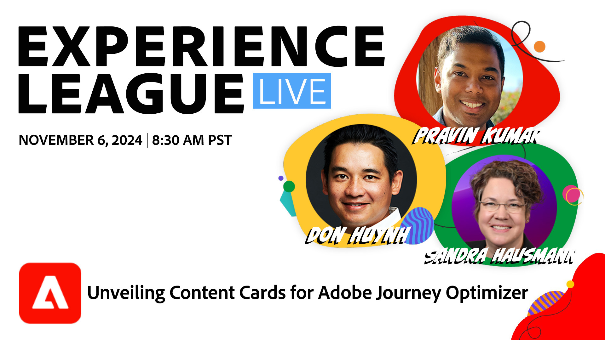

# Experience League LIVE

Experience League LIVE est une émission en streaming produite par l&#39;équipe Experience League.  Vous avez la possibilité de vous connecter avec des experts Adobes en produits et de découvrir des conseils pratiques, des astuces et des stratégies que vous pouvez appliquer aux applications Adobe Experience Cloud.

## Événements LIVE Experience League à venir

<table>
<tr>

<td style="vertical-align: top;">
    

      <a href="episodes/exl-live-episode-10-30-24.md"><strong>Découvrez les cartes de contenu, un nouveau canal de messagerie polyvalent pour Adobe Journey Optimizer conçu pour améliorer l’engagement des utilisateurs et stimuler les conversations dans les applications mobiles et web. </strong></a>
       <em> avec Don Huyhn et Pravin Kumar</em>
       <em>6 novembre 2024 à 8:30 PT</em>
        <a href="https://engage.adobe.com/ExpLeagueLive-241030.html?s_rtid=7015Y0000048hxzQAA&amp;s_iid=&amp;sfid=&amp;acctid=&amp;ecp=">Inscrivez-vous à cet événement</a>
    

  </td>
</tr>
</table>

## Choix du personnel

<table style="max-width: 1214px;">

<tr>
  <td style="vertical-align: top;">
    

      <a href="episodes/exl-live-episode-06-26-24.md">
        <strong>Comment les dernières versions d’Adobe Real-Time CDP peuvent-elles déplacer l’aiguille de votre entreprise</strong>
      </a>
       <em> avec Nina Caruso, Rudi Shumpert et Doug Moore</em>
       <em>26 juin 2024</em>
    

  </td>

<td style="vertical-align: top;">
    
    

      <a href="episodes/exl-live-episode-05-16-24.md"><strong>C’est la manière...de migrer Analytics vers le SDK Web</strong></a>
       <em> avec Mitch Rice, Joe Khoury et Doug Moore </em>
       <em>16 mai 2024</em>
    

  </td>

<td style="vertical-align: top;">
    
    

      <a href="episodes/exl-live-episode-04-24-24.md">
        <strong>Nouveau canal d’expérience basé sur le code dans Journey Optimizer</strong>
      </a>
       <em> avec Sandra Hausmann, Robert Calangiu et Brent Kostak</em>
       <em>24 avril 2024</em>
    

  </td>
  </tr>

</table>

>[!TIP]
>
>Pour découvrir d&#39;autres méthodes d&#39;apprentissage, consultez nos [cours](https://experienceleague.adobe.com/?lang=fr/#dashboard/learning) gratuits ainsi que nos [tutoriels](https://experienceleague.adobe.com/docs/home-tutorials.html?lang=fr) individuels.
