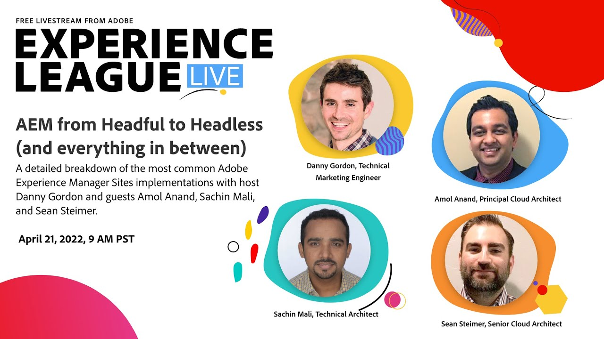
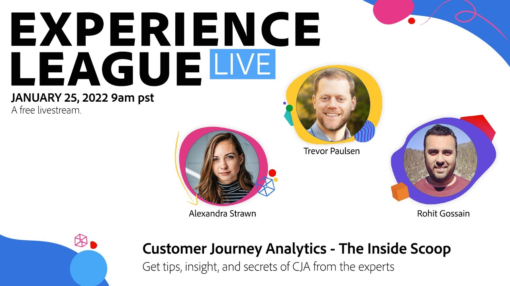

# Experience League LIVE

Experience League LIVE est une émission en streaming produite par l&#39;équipe Experience League.  Vous avez la possibilité de vous connecter avec des experts Adobes en produits et de découvrir des conseils pratiques, des astuces et des stratégies que vous pouvez appliquer aux applications Adobe Experience Cloud.

## Événements LIVE Experience League à venir

<table>
<tr>

<td style="vertical-align: top;">
      <b>Revenez bientôt découvrir de nouveaux programmes à venir ! En attendant, visionnez nos épisodes précédents en cliquant sur les liens ci-dessous ou dans le volet de navigation de gauche.</b>
  </td>
</tr>
</table>

## Choix du personnel

<table style="max-width: 1214px;">

<tr>
  <td style="vertical-align: top;">
    

      <a href="/help/experience-league-live/episodes/exl-live-episode-04-21-22.md">
        <strong>AEM de Headless à Headless</strong>
      </a>
       <em>avec Danny Gordon, Amol Anand, Sachin Mali et Sean Steimer</em>
       <em>21 avril 2022</em>
    

  </td>

<td style="vertical-align: top;">
    
    

      <a href="episodes/exl-live-episode-08.md"><strong>Customer Journey Analytics - L'école intérieure</strong></a>
       <em>avec Trevor Paulsen, Rohit Gossain, Alex Strawn</em>
       <em>25 janvier 2021</em>
    

  </td>

<td style="vertical-align: top;">
    
    

      <a href="episodes/exl-live-episode-05-26-22.md">
        <strong>Demandez aux experts : Principes de base du SDK Web</strong>
      </a>
       <em>avec Rudi Shumpert, Jeff Chasin et Eric Matisoff</em>
       <em>26 mai 2022</em>
    

  </td>
  </tr>

</table>

>[!TIP]
>
>Pour découvrir d’autres méthodes d’apprentissage, consultez notre [courses](https://experienceleague.adobe.com/?lang=fr/#dashboard/learning) ainsi que individuellement [tutoriels](https://experienceleague.adobe.com/docs/home-tutorials.html?lang=fr).
