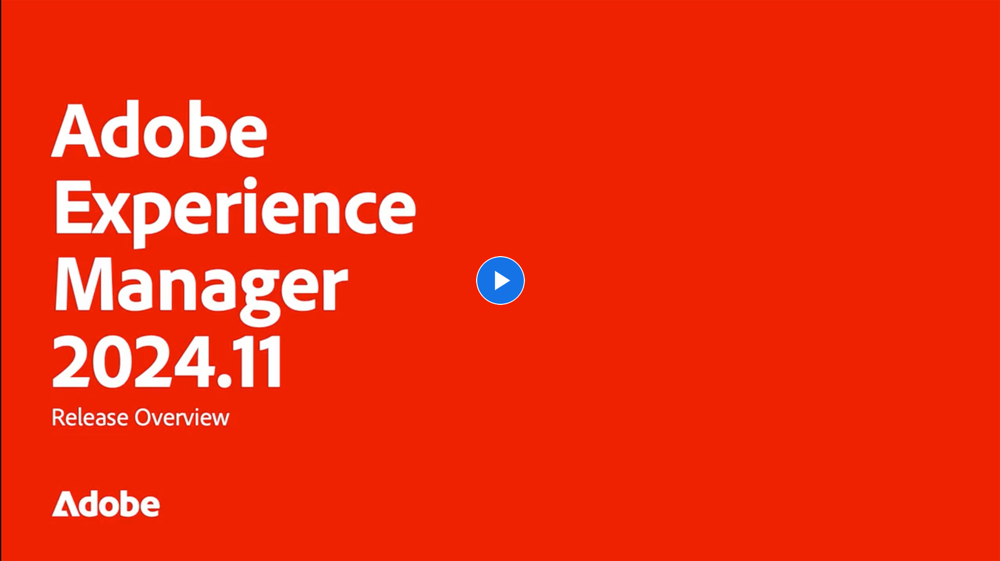

# Mises à jour des versions d’Adobe Experience Manager as a Cloud Service

Obtenez un aperçu rapide des dernières fonctionnalités d’Adobe Experience Manager as a Cloud Service. Il s’agit de courtes vidéos d’environ 10 minutes diffusées par l’équipe produit d’AEM, qui présentent les principales caractéristiques de la dernière version.

## Dernière Mise À Jour

<!-- CARDS

{cta = More details}

* 2024/2024-11-0.md

-->
<!-- START CARDS HTML - DO NOT MODIFY BY HAND -->

    

        

            

                <figure class="image x-is-16by9">
                    
                </figure>
            

            

                

                    

                        <a href="2024/2024-11-0.md" target="_blank" rel="referrer" title="Version 2024.11.0 D’AEM - Aperçu">2024.11.0 Présentation De La Version AEM</a>
                    

                    
Cette version met en évidence les mises à jour importantes apportées à Adobe Experience Manager (AEM) Sites et Assets, notamment l’extensibilité améliorée de l’interface, les nouvelles options de rendu, les modificateurs d’image avancés et les améliorations apportées aux Edge Delivery Services avec l’éditeur universel dans AEM.

                

                <a href="2024/2024-11-0.md" target="_blank" rel="referrer" class="spectrum-Button spectrum-Button--outline spectrum-Button--primary spectrum-Button--sizeM" style="align-self: flex-start; margin-top: 1rem;">
                    Plus de détails
                </a>
            

        

    

<!-- END CARDS HTML - DO NOT MODIFY BY HAND -->

## Mises à jour précédentes

<!-- CARDS
{cta = More details}

  * 2024/2024-10-0.md
  * 2024/2024-9-0.md
  * 2024/2024-8-0.md
  * 2024/2024-7-0.md
  * 2024/2024-6-0.md
  * 2024/2024-5-0.md
  * 2024/2024-4-0.md
  * 2024/2024-3-0.md
  * 2024/2024-1-0.md
  
-->
<!-- START CARDS HTML - DO NOT MODIFY BY HAND -->

    

        

            

                <figure class="image x-is-16by9">
                    
                </figure>
            

            

                

                    

                        <a href="2024/2024-10-0.md" target="_blank" rel="referrer" title="Présentation De La Version 2024.10.0 D’AEM">2024.10.0 Présentation De La Version AEM</a>
                    

                    
Les fonctionnalités de cette version sont axées sur les innovations de Experience Manager Assets et du Cloud Service et comprennent les éléments suivants : AEM Assets Nouveaux prix et packaging pour AEM Assets avec Assets Ultimate et Asset PrimeAEM Cloud Service Transférer les journaux vers d’autres destinations Redirections d’URL sans pipeline pour les utilisateurs professionnels ​ les RDE prennent en charge la configuration du pipeline YAML ​ Interactive AEM Developer Console

                

                <a href="2024/2024-10-0.md" target="_blank" rel="referrer" class="spectrum-Button spectrum-Button--outline spectrum-Button--primary spectrum-Button--sizeM" style="align-self: flex-start; margin-top: 1rem;">
                    Plus de détails
                </a>
            

        

    

    

        

            

                <figure class="image x-is-16by9">
                    
                </figure>
            

            

                

                    

                        <a href="2024/2024-9-0.md" target="_blank" rel="referrer" title="Présentation De La Version 2024.9.0 D’AEM">Présentation De La Version AEM 2024.9.0</a>
                    

                    
Les fonctionnalités de cette version sont axées sur les innovations de Experience Manager Assets et de Cloud Service et incluent les éléments suivants : AEM Assets - Amélioration du sélecteur de ressources pour la prise en charge des collections​ Assets Content Hub - prise en charge de la gestion des droits numériques (ressources expirées et sous licence)​AEM Cloud Service - prise en charge de Cloud Manager pour Edge Delivery​ AEM Side Includes (ESI) ​ authentification de base​ Interactive Edge Developer Console

                

                <a href="2024/2024-9-0.md" target="_blank" rel="referrer" class="spectrum-Button spectrum-Button--outline spectrum-Button--primary spectrum-Button--sizeM" style="align-self: flex-start; margin-top: 1rem;">
                    Plus de détails
                </a>
            

        

    

    

        

            

                <figure class="image x-is-16by9">
                    
                </figure>
            

            

                

                    

                        <a href="2024/2024-8-0.md" target="_blank" rel="referrer" title="Présentation De La Version 2024.8.0 D’AEM">Présentation De La Version AEM 2024.8.0</a>
                    

                    
Les fonctionnalités de cette version se concentrent sur les innovations AEM Assets &amp; Dynamic Media, Forms, Sites et Cloud Foundation et incluent les éléments suivants : - Dynamic Media Composable Templates for 1:1 dynamic variations Forms GenAI Assistant Éditeur universel avec une nouvelle intégration de structure de contenu AEM​ Gérer le cycle de vie des certificats DV et la prise en charge des Edge Delivery Services via le tableau de bord de contrôle de l’expérience Cloud Manager Améliorations des performances du pipeline

                

                <a href="2024/2024-8-0.md" target="_blank" rel="referrer" class="spectrum-Button spectrum-Button--outline spectrum-Button--primary spectrum-Button--sizeM" style="align-self: flex-start; margin-top: 1rem;">
                    Plus de détails
                </a>
            

        

    

    

        

            

                <figure class="image x-is-16by9">
                    
                </figure>
            

            

                

                    

                        <a href="2024/2024-7-0.md" target="_blank" rel="referrer" title="Présentation De La Version 2024.7.0 D’AEM">Présentation de la version AEM 2024.7.0</a>
                    

                    
Les fonctionnalités de cette version sont axées sur les innovations du Experience Manager Assets et du Cloud Service et comprennent les éléments suivants :AEM Assets:Content Credentials dans les sous-titres AEM Assets​AI optimisés pour la vidéo avec les améliorations du sélecteur de ressources Dynamic Media pour le chargement​ ​Cloud Manager:Configuration en libre-service des informations d’identification de réseau CDN gérées par le client​Purge du réseau CDN​alertes des règles de filtrage de trafic​

                

                <a href="2024/2024-7-0.md" target="_blank" rel="referrer" class="spectrum-Button spectrum-Button--outline spectrum-Button--primary spectrum-Button--sizeM" style="align-self: flex-start; margin-top: 1rem;">
                    Plus de détails
                </a>
            

        

    

    

        

            

                <figure class="image x-is-16by9">
                    
                </figure>
            

            

                

                    

                        <a href="2024/2024-6-0.md" target="_blank" rel="referrer" title="Présentation de la version 2024.6.0 d’AEM">Présentation de la version AEM 2024.6.0</a>
                    

                    
Les fonctionnalités de la version de juin 2024 se concentrent sur AEM Assets avec Content Hub, Dynamic Media avec les fonctionnalités OpenAPI, les améliorations du sélecteur Assets (balises et ressources expirées), les modèles de fragment de contenu dans l’Admin Console de fragments de contenu, Cloud Foundation (Ajout de référentiels privés dans Cloud Manager) et Cloud Foundation (Restauration de contenu).

                

                <a href="2024/2024-6-0.md" target="_blank" rel="referrer" class="spectrum-Button spectrum-Button--outline spectrum-Button--primary spectrum-Button--sizeM" style="align-self: flex-start; margin-top: 1rem;">
                    Plus de détails
                </a>
            

        

    

    

        

            

                <figure class="image x-is-16by9">
                    
                </figure>
            

            

                

                    

                        <a href="2024/2024-5-0.md" target="_blank" rel="referrer" title="Présentation De La Version 2024.5.0 D’AEM">Présentation De La Version AEM 2024.5.0</a>
                    

                    
Les fonctionnalités de cette version se concentrent sur : - Nouvelles options Publish pour les améliorations de l’éditeur universel AEM et Dynamic Media Migration des composants de base de Forms adaptatif vers les composants principaux Prise en charge supplémentaire de Captcha dans les améliorations de la base cloud de Forms adaptatif

                

                <a href="2024/2024-5-0.md" target="_blank" rel="referrer" class="spectrum-Button spectrum-Button--outline spectrum-Button--primary spectrum-Button--sizeM" style="align-self: flex-start; margin-top: 1rem;">
                    Plus de détails
                </a>
            

        

    

    

        

            

                <figure class="image x-is-16by9">
                    
                </figure>
            

            

                

                    

                        <a href="2024/2024-4-0.md" target="_blank" rel="referrer" title="Présentation De La Version 2024.4.0 D’AEM">Présentation de la version AEM 2024.4.0</a>
                    

                    
Les fonctionnalités de cette version se concentrent sur les innovations de Experience Manager Assets et du Cloud Service et incluent les éléments suivants : AEM Assets:1-cliquez sur le changement de nom de ressource/dossier dans l’affichage AssetsExpérience de recherche simplifiée à l’aide du langage naturelAperçu des rendus dynamiques, y compris le recadrage intelligent à partir d’Assets Affichage Modifier facilement les vidéos dans AEM avec les actions rapides d’ExpressOptimisations et réglages de Cloud Manager:CDNconfiguration en libre-service de la purge de version et des tâches de maintenance des journaux d’auditÉtendre la diffusion en continu des journaux aux fournisseurs au-delà de Splunk, avec une prise en charge IP dédiée et en libre-servicePrise en charge CDN pour ESI, également via SDIIExpérience de journalisation Java améliorée pour RDE

                

                <a href="2024/2024-4-0.md" target="_blank" rel="referrer" class="spectrum-Button spectrum-Button--outline spectrum-Button--primary spectrum-Button--sizeM" style="align-self: flex-start; margin-top: 1rem;">
                    Plus de détails
                </a>
            

        

    

    

        

            

                <figure class="image x-is-16by9">
                    
                </figure>
            

            

                

                    

                        <a href="2024/2024-3-0.md" target="_blank" rel="referrer" title="Présentation De La Version 2024.3.0 D’AEM">Présentation de la version AEM 2024.3.0</a>
                    

                    
Expériences à fort impact Création AEM avec des Edge Delivery Services Edge Delivery Services pour FormsContenu pour tous, pour tous Éditeur universel Intelligence exploitable AEM Sites - Générer des variations de contenu (GenAI)Développement rapide API ouvertes CruD pour les fragments de contenu et les modèlesCloud Service Foundation Mise en réseau avancéeAutres améliorations notables Comparer les versions de fragments de contenu Prise en charge de la gestion multisite pour les fragments d’expérience Importateur de contenu mis à jour v1.51.0 Extension de Sidekick v6.41.0

                

                <a href="2024/2024-3-0.md" target="_blank" rel="referrer" class="spectrum-Button spectrum-Button--outline spectrum-Button--primary spectrum-Button--sizeM" style="align-self: flex-start; margin-top: 1rem;">
                    Plus de détails
                </a>
            

        

    

    

        

            

                <figure class="image x-is-16by9">
                    
                </figure>
            

            

                

                    

                        <a href="2024/2024-1-0.md" target="_blank" rel="referrer" title="Présentation De La Version 2024.1.0 D’AEM">Présentation de la version AEM 2024.1.0</a>
                    

                    
Les fonctionnalités de cette version sont axées sur les innovations de Experience Manager Assets et du Cloud Service et comprennent les éléments suivants : AEM Assets - Intégration de AEM Assets Cloud Service et de Adobe Journey Optimizer, Liste bloquée de balises intelligentes, rendu d’aperçu vidéo prêt à l’emploi, Cloud Manager - Autorisations personnalisées

                

                <a href="2024/2024-1-0.md" target="_blank" rel="referrer" class="spectrum-Button spectrum-Button--outline spectrum-Button--primary spectrum-Button--sizeM" style="align-self: flex-start; margin-top: 1rem;">
                    Plus de détails
                </a>
            

        

    

<!-- END CARDS HTML - DO NOT MODIFY BY HAND -->
