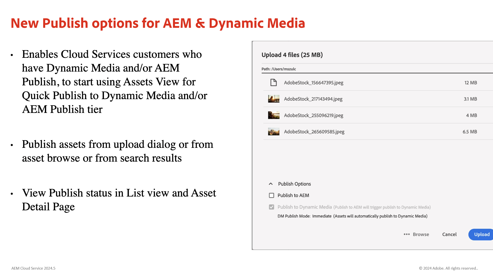
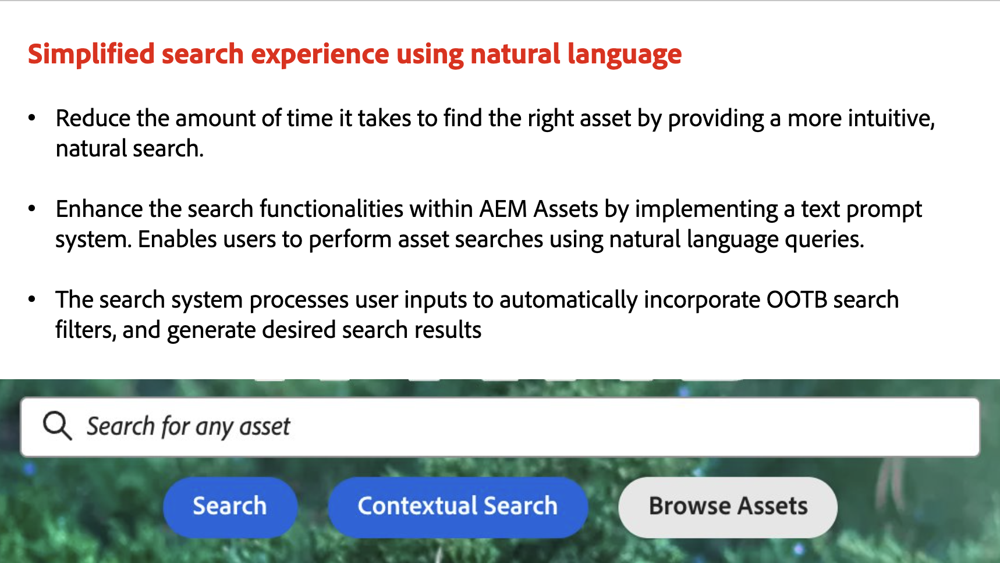
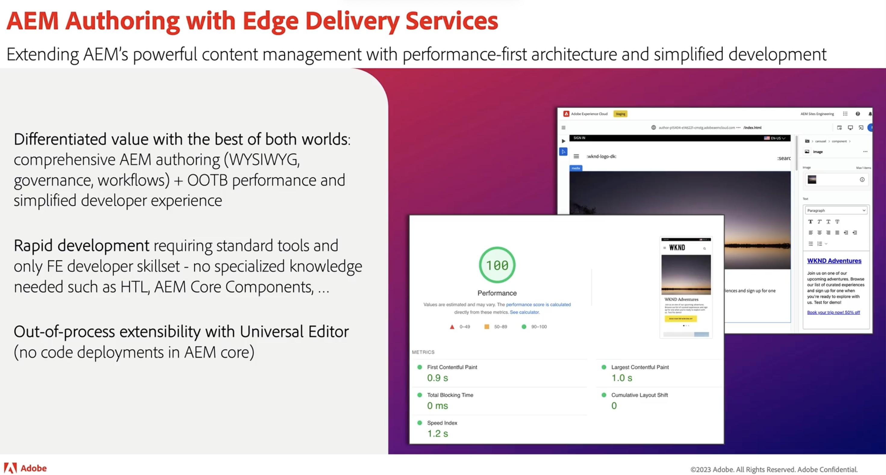
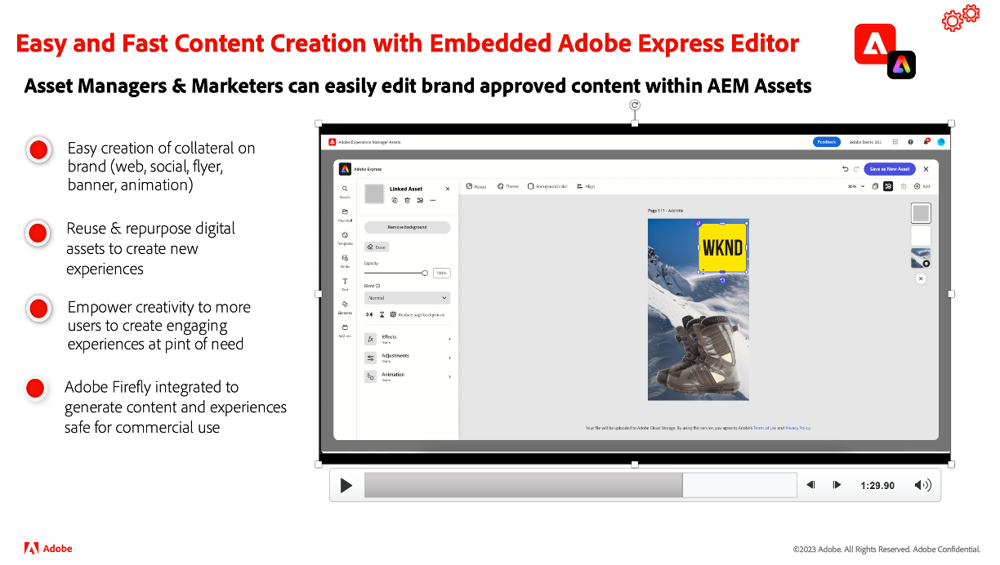
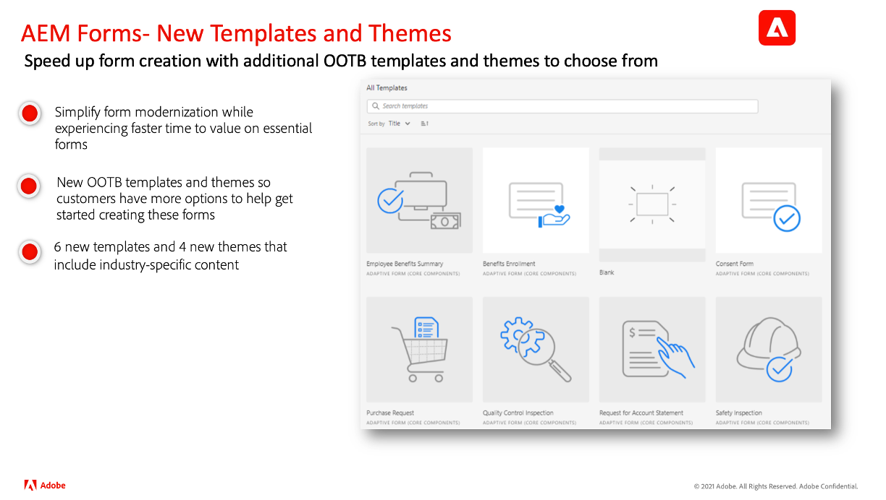
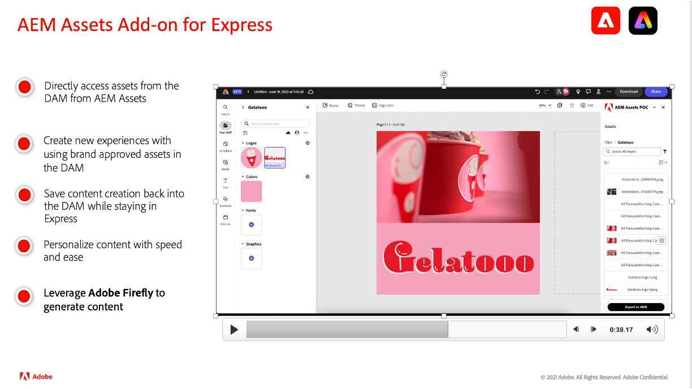

# Mises à jour des versions d’Adobe Experience Manager as a Cloud Service

Découvrez rapidement les dernières fonctionnalités d’Adobe Experience Manager as a Cloud Service. Il s’agit de vidéos courtes, d’environ 10 minutes, diffusées par l’équipe produit d’AEM qui partagent les points forts de la dernière version.

## Dernière mise à jour

<table style="max-width: 50%;">
  <tr>
    <td>
      
      

        <a href="2024/2024-8-0.md">
          <strong> Version | 2024.8.0</strong>
        </a>
      

      <em>Date de publication Août 2024 </em>
      

        <a href="https://experienceleague.adobe.com/docs/experience-manager-cloud-service/content/release-notes/release-notes/release-notes-current.html?lang=fr">Notes de mise à jour</a>
      

    </td>
  </tr>  
</table>

## Mises à jour précédentes

<table style="max-width: 50%;">
  <tr>
    <td>
      
      

        <a href="2024/2024-7-0.md">
          <strong> Version | 2024.7.0</strong>
        </a>
      

      <em>Date de publication juillet 2024 </em>
      

        <a href="https://experienceleague.adobe.com/docs/experience-manager-cloud-service/content/release-notes/release-notes/release-notes-current.html?lang=fr">Notes de mise à jour</a>
      

    </td> 
     <td>
      
      

        <a href="2024/2024-6-0.md">
          <strong> Version | 2024.6.0</strong>
        </a>
      

      <em>Date de publication juin 2024 </em>
      

        <a href="https://experienceleague.adobe.com/docs/experience-manager-cloud-service/content/release-notes/release-notes/release-notes-current.html?lang=fr">Notes de mise à jour</a>
      

     </td>
     <td>
      
      

        <a href="2024/2024-5-0.md">
          <strong> Version | 2024.5.0</strong>
           
        </a>
      

      <em>Date de publication mai 2024 </em>
    </td>
  </tr>
  <tr> 
    <td>
      
      

        <a href="2024/2024-4-0.md">
          <strong> Version | 2024.4.0</strong>
           
        </a>
      

      <em>Date de publication avril 2024 </em>
    </td>
    <td>
      
      

        <a href="2024/2024-3-0.md">
          <strong> Version | 2024.3.0</strong>
           
        </a>
      

      <em>Date de publication avril 2024 </em>
    </td>   
    <td>
      
      

        <a href="2024/2024-1-0.md">
          <strong> Version | 2024.1.0</strong>
           
        </a>
          <em>Date de publication : janvier 2024 </em>
      

    </td>
  </tr>
  <tr>     
    <td>
      
      

        <a href="2023/2023-11-0.md">
          <strong> Version | 2023.11.0</strong>
           
        </a>
          <em>Date de publication novembre 2023 </em>
      

    </td>
    <td>
      
      

        <a href="2023/2023-10-0.md">
          <strong> Version | 2023.10.0</strong>
           
        </a>
          <em>Date de publication octobre 2023 </em>
      

    </td>
    <td>
      
      

        <a href="2023/2023-9-0.md">
          <strong> Version | 2023.9.0</strong>
           
        </a>
          <em>Date de publication septembre 2023 </em>
      

    </td>
  </tr>
</table>
