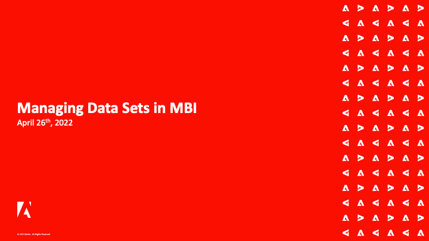
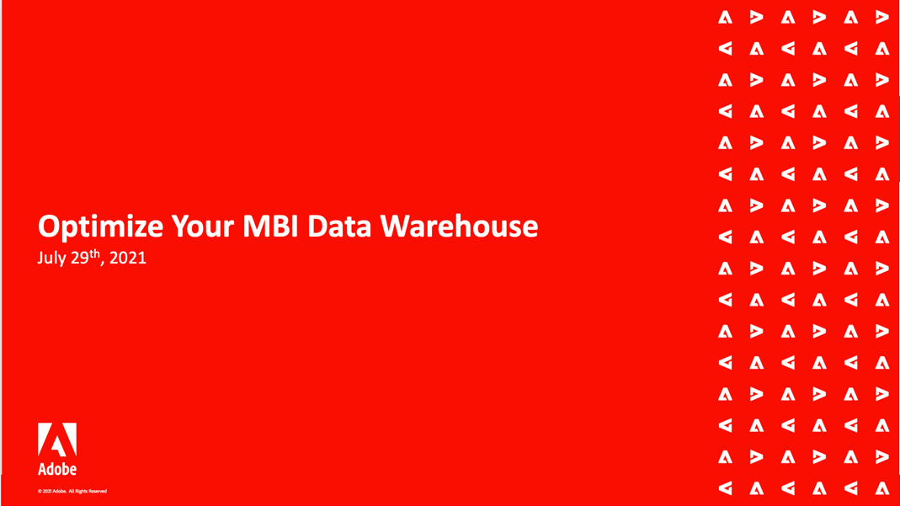

# Webinaires Adobe Commerce Intelligence

>[!NOTE]
>
>Adobe Commerce Intelligence était auparavant connu sous le nom de [!DNL Magento Business Intelligence (MBI)]. Les enregistrements pour les événements passés reflètent le nom précédent.

La série de webinaires Intelligence de Commerce est un événement périodique pour les clients de l’IMS. Les webinaires abordent un large éventail de sujets et de bonnes pratiques concernant l’utilisation de l’intelligence de commerce à son plein potentiel.

Les participants de tous les pays peuvent participer aux événements en direct pour mieux comprendre le produit et obtenir une réponse directe à leurs questions sur la fonctionnalité de renseignements sur le commerce.

Les rubriques sont répétées occasionnellement pour répondre à toutes les nouvelles questions que les clients peuvent poser.

## Sélections du personnel

<table>
<tr>
  <td>
    
     

      <a href="https://experienceleague.adobe.com/docs/events/mbi-webinars-recordings/2021/getting-started.html">
        <strong>Prise en main de MBI</strong>
      </a>
    

    

    <em>Découvrez les principales fonctionnalités de Commerce Intelligence directement au sein de l’équipe produit, avec des informations détaillées sur les tableaux de bord préconfigurés et les options de personnalisation disponibles.</em>
    

  </td>
  <td>
    
     

      <a href="https://experienceleague.adobe.com/docs/events/mbi-webinars-recordings/2023/manage-data-sets.html">
        <strong>Gestion des jeux de données dans MBI</strong>
      </a>
    

    

    <em>Découvrez certaines des puissantes fonctionnalités du MBI Data Warehouse Manager, directement auprès l’équipe produit Adobe Commerce. Allez au-delà de la création de rapports de base et apprenez à en faire plus avec vos données.</em>
    

  </td>
   <td>
    
     

      <a href="https://experienceleague.adobe.com/docs/events/mbi-webinars-recordings/2021/optimize-data-warehouse.html">
        <strong>Optimisation de votre entrepôt de données MBI</strong>
      </a>
    

    

    <em>Le Gestionnaire des Data Warehouse vous permet de gérer les paramètres de synchronisation des tableaux et des colonnes, d’explorer en détail le schéma d’un tableau et de créer des colonnes calculées à utiliser dans les rapports.</em>
    

  </td>
</tr>
</table>

>[!TIP]
>
>**Tous les webinaires enregistrés sont répertoriés dans la navigation de gauche.**.

## Ressources utiles

- [Vidéos et tutoriels sur Commerce Intelligence](https://experienceleague.adobe.com/docs/commerce-learn/tutorials/mbi/filter-sets.html)
- [Guide de l’utilisateur de Commerce Intelligence](https://experienceleague.adobe.com/docs/commerce-business-intelligence/mbi/guide-overview.html?lang=fr)
