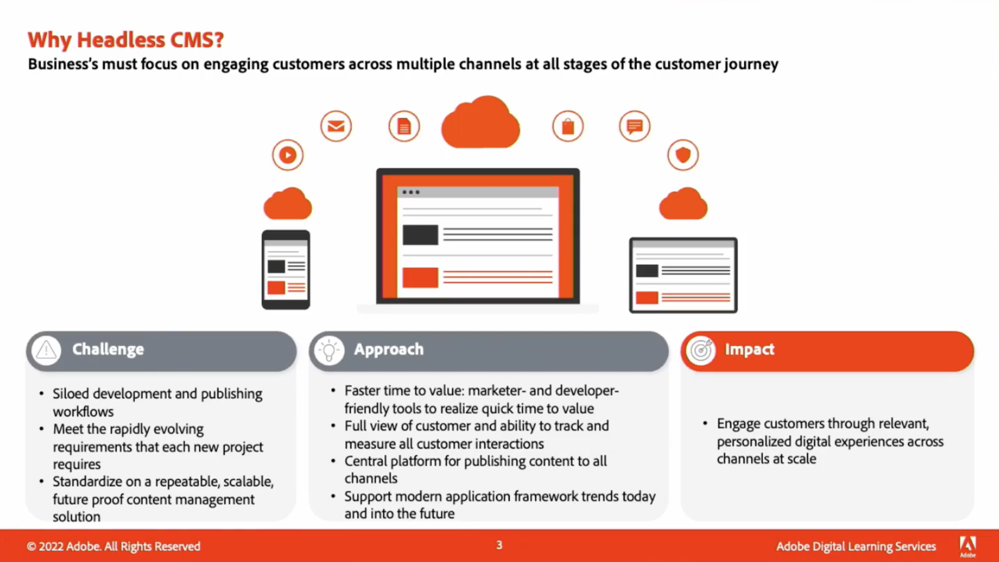
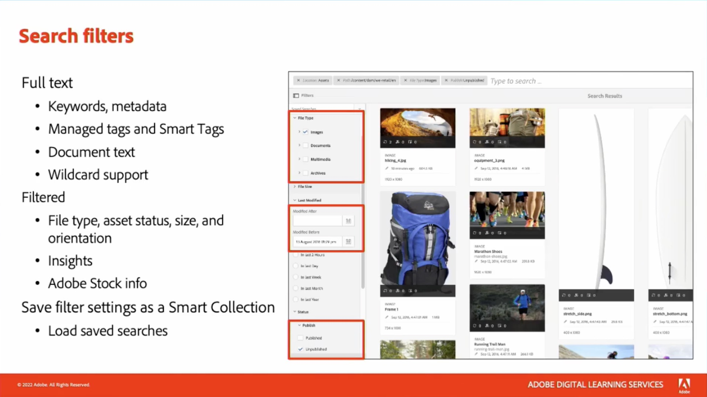
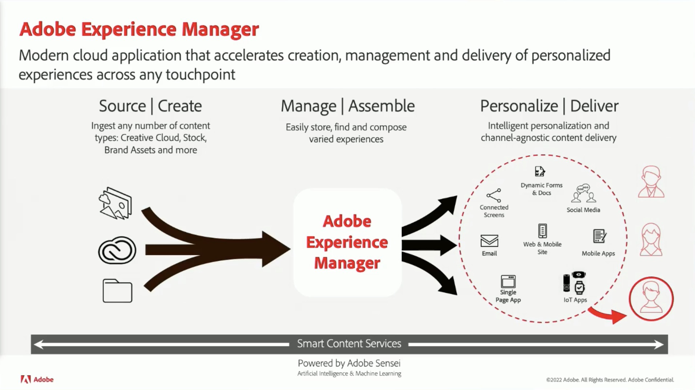

# Contenu et Commerce

Créez et gérez un large éventail de sites web, d’applications mobiles et de formulaires attrayants. Apprenez également à créer des expériences commerciales multicanales sur une seule plateforme grâce à notre solution de commerce flexible optimisée par l’IA.

## Nouveautés

<table>
<tr>
  <td>
    
     

      <a href="https://experienceleague.adobe.com/docs/skill-builder-events/skill-builder/content-and-commerce/2022/headless.html">
        <strong>Proposer des expériences headless avec Adobe Experience Manager</strong>
      </a>
    

    

    <em>Découvrez la gestion de l’expérience headless en utilisant les dernières améliorations du Fragment de contenu d’Experience Manager et la nouvelle API GraphQL pour la diffusion de contenu headless.</em>
    

  </td>
  <td>
    
     

      <a href="https://experienceleague.adobe.com/docs/skill-builder-events/skill-builder/content-and-commerce/2022/metadata.html">
        <strong>Mettez les métadonnées au service de votre entreprise dans Adobe Experience Manager Assets</strong>
      </a>
    

    

    <em>Découvrez comment tirer le meilleur parti de vos métadonnées dans AEM Assets en réduisant la charge de travail pour baliser les ressources et en facilitant leur consultation.</em>
    

  </td>  
  <td>
    
     

      <a href="https://experienceleague.adobe.com/docs/skill-builder-events/skill-builder/content-and-commerce/2022/workflow.html">
        <strong>Tirer le meilleur parti de la gestion des workflows d’entreprise</strong>
      </a>
    

    

    <em>Au cours de cette session, vous découvrirez les avantages de l’utilisation de workflows pour la gestion de vos ressources et comment les créer rapidement.</em>
    

  </td>
</tr>
</table>

>[!TIP]
>
>**Toutes les sessions enregistrées sont répertoriées dans le volet de navigation de gauche.**.
