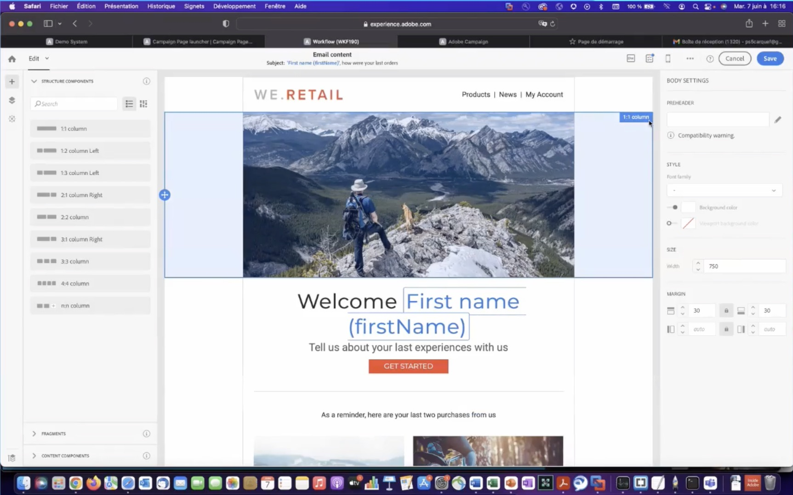

# Parcours clients

Développez des profils client en temps réel en extrayant des données de toutes les sources pour créer des parcours personnalisés et cross-canal.

## Nouveautés

<table>
<tr>
  <td>
    
     

      <a href="https://experienceleague.adobe.com/docs/skill-builder-events/skill-builder/customer-journeys/2022/b2b-campaigns.html">
        <strong>Better together - Adobe Marketo Engage et Real-Time CDP</strong>
      </a>
    

    

    <em>Découvrez comment orchestrer des campagnes B2B avec Marketo Engage et RT-CDP (édition B2B) et quels sont les principaux cas d’utilisation et avantages déverrouillés.</em>
    

  </td>
  <td>
    
     

      <a href="https://experienceleague.adobe.com/docs/skill-builder-events/skill-builder/customer-journeys/2022/data-models.html">
        <strong>Développement et personnalisation de modèles de données dans Adobe Campaign Classic</strong>
      </a>
    

    

    <em>Rejoignez cette session avec notre formateur Campaign pour apprendre à développer un schéma de données dans un modèle de données dans Campaign Classic.</em>
    

  </td>  
  <td>
    
     

      <a href="https://experienceleague.adobe.com/docs/skill-builder-events/skill-builder/customer-journeys/2022/tips-and-tricks.html">
        <strong>Conseils et astuces pour Adobe Campaign Standard</strong>
      </a>
    

    

    <em>Connectez-vous à votre instance Adobe Campaign Standard et découvrez les bonnes pratiques relatives à la fatigue de ciblage, de personnalisation et de marketing pour une meilleure utilisation d’ACS.</em>
    

  </td>
</tr>
</table>

>[!TIP]
>
>**Toutes les sessions enregistrées sont répertoriées dans le volet de navigation de gauche.**.
