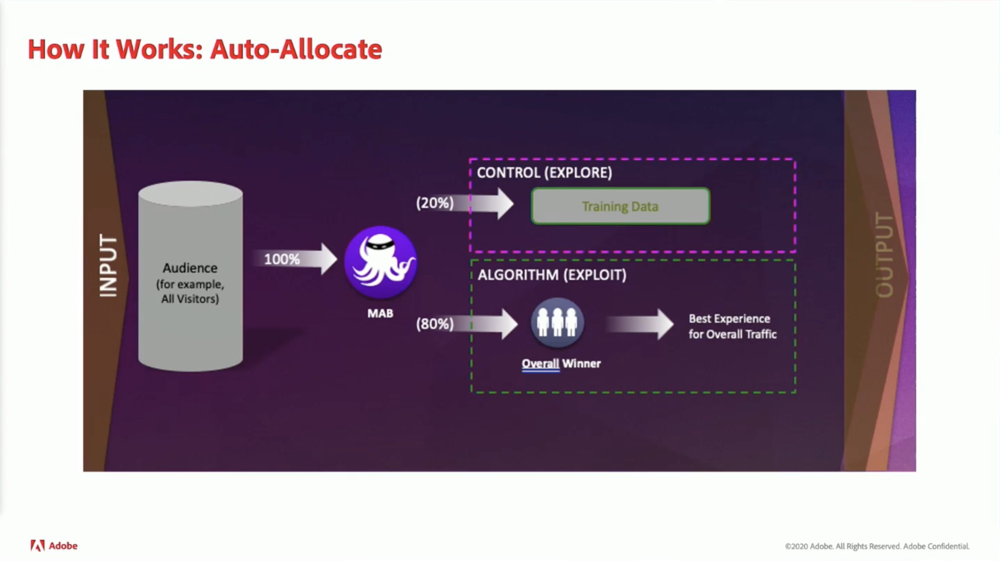
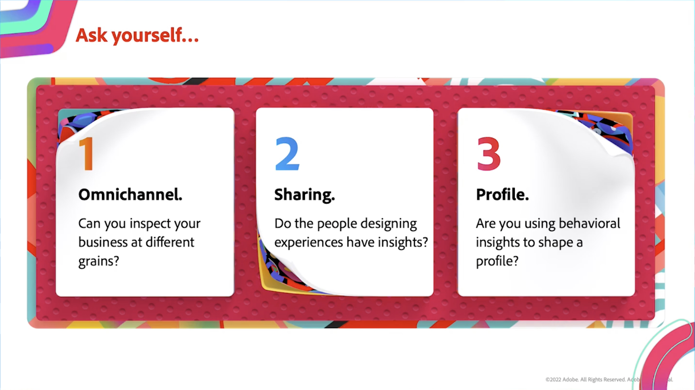
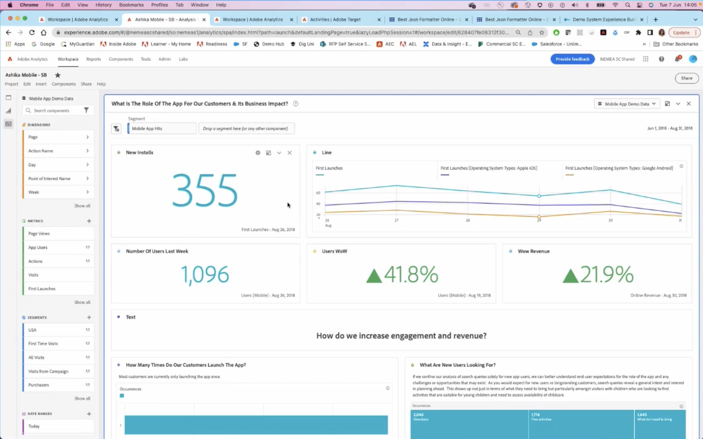

# Données et informations

Effectuez une personnalisation en temps réel sur n’importe quel canal à l’aide d’informations sur les données en ligne et hors ligne dans l’ensemble de votre organisation.

## Nouveautés

<table>
<tr>
  <td>
    
     

      <a href="https://experienceleague.adobe.com/docs/events//data-and-insights/2022/personalize.html">
        <strong>Personnaliser et automatiser avec Adobe Target</strong>
      </a>
    

    

    <em>Rejoignez cette session pour découvrir les concepts de base de l’automatisation et de l’optimisation des fonctionnalités d’Adobe Target à l’aide du ciblage automatique et de la personnalisation automatique.</em>
    

  </td>
  <td>
    
     

      <a href="https://experienceleague.adobe.com/docs/events//data-and-insights/2022/innovations.html">
        <strong>Innovations et tendances 2022</strong>
      </a>
    

    

    <em>Au cours de cette session de présentation, vous découvrirez les principales tendances en matière de D&amp;I. Rejoignez-nous pour explorer la manière dont vous pouvez utiliser vos données de manière pertinente en maximisant entièrement vos investissements Experience Cloud et en découvrant de nouvelles innovations.</em>
    

  </td>  
  <td>
    
     

      <a href="https://experienceleague.adobe.com/docs/events//data-and-insights/2022/mobile-and-apps.html">
        <strong>Applications Analytics et Target pour les applications mobiles et les applications</strong>
      </a>
    

    

    <em>Au cours de cette session, vous découvrirez les bonnes pratiques relatives à l’utilisation des tableaux de bord Analytics sur les appareils mobiles, ainsi que la personnalisation des applications via Target.</em>
    

  </td>
</tr>
</table>

>[!TIP]
>
>**Toutes les sessions enregistrées sont répertoriées dans le volet de navigation de gauche.**.
