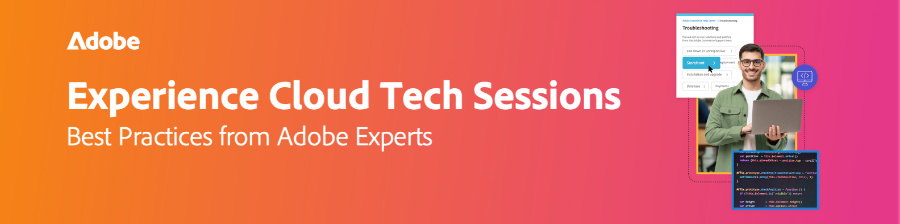

# Enregistrements des sessions techniques Experience Cloud

{align="center"}

Libérez tout le potentiel de Adobe Experience Cloud avec des sessions techniques en direct et à la demande. Ces webinaires sont soigneusement conçus pour aller au-delà de la prise en charge traditionnelle. Dirigées par des experts chevronnés d’Adobe, les sessions fournissent des conseils, des astuces et des stratégies utiles pour vous aider à parcourir les solutions techniques en toute confiance, en évitant les pièges courants. Les experts d’Adobe sont des ingénieurs du support technique qui traitent les principales préoccupations et travaillent activement sur les cas quotidiens. Grâce aux options en direct et à la demande, vous avez la possibilité d’accéder aux informations quand vous en avez besoin, assurant ainsi une expérience d’apprentissage transparente.

## Sessions 2025

<!-- CARDS
{cta = Watch}

* 2025/acc-delivery-performance.md
* 2025/dispatcher-configurations.md
* 2025/fastly-and-adobe-commerce.md
* 2025/getting-most-marketo-measure.md
* 2025/marketo-post-migration.md
* 2025/marketo-pre-migration.md
* 2025/migrate-analytics-to-aep-web-sdk.md
  
-->
<!-- START CARDS HTML - DO NOT MODIFY BY HAND -->

    

        

            

                <figure class="image x-is-16by9">
                    
                </figure>
            

            

                

                    

                        <a href="2025/acc-delivery-performance.md" target="_blank" rel="referrer" title="Performances de diffusion de Adobe Campaign Classic - Dépannage">Performances De Diffusion Adobe Campaign Classic - Dépannage</a>
                    

                    
Cette session a couvert les principales stratégies permettant d’améliorer les performances des diffusions par e-mail et SMS à l’aide d’Adobe Campaign. Elle a permis de relever des défis courants tels que les retards de diffusion, le faible débit et la lenteur des transactions, en offrant des solutions tels que l’optimisation des lots, la journalisation SQL et la surveillance des performances du serveur. Les bonnes pratiques en matière de délivrabilité incluent l'authentification correcte des e-mails (SPF, DKIM, DMARC), la surveillance des listes noires et les vérifications de spam. Pour de meilleures performances, les experts recommandent de nettoyer les workflows, de limiter les règles et d’éviter les conteneurs partagés. Conseils de diffusion SMS axés sur la configuration correcte du compte externe et l’analyse des journaux. La session a également mis l’accent sur la validation du suivi, la maintenance de la base de données à l’aide de rapports de surcharge et l’application de règles de pression/fatigue pour stimuler l’engagement. Un enregistrement de session sera partagé par e-mail et publié sur le site d’Adobe Experience Platform.

                

                <a href="2025/acc-delivery-performance.md" target="_blank" rel="referrer" class="spectrum-Button spectrum-Button--outline spectrum-Button--primary spectrum-Button--sizeM" style="align-self: flex-start; margin-top: 1rem;">
                    Regarder
                </a>
            

        

    

    

        

            

                <figure class="image x-is-16by9">
                    
                </figure>
            

            

                

                    

                        <a href="2025/dispatcher-configurations.md" target="_blank" rel="referrer" title="Configurations de Dispatcher dans Adobe Experience Manager as a Cloud Service">Configurations de Dispatcher dans Adobe Experience Manager as a Cloud Service</a>
                    

                    
Découvrez les bonnes pratiques d’AEM Dispatcher en matière de mise en cache, de sécurité et de performances afin d’optimiser l’évolutivité et l’efficacité d’AEM as a Cloud Service.

                

                <a href="2025/dispatcher-configurations.md" target="_blank" rel="referrer" class="spectrum-Button spectrum-Button--outline spectrum-Button--primary spectrum-Button--sizeM" style="align-self: flex-start; margin-top: 1rem;">
                    Regarder
                </a>
            

        

    

    

        

            

                <figure class="image x-is-16by9">
                    
                </figure>
            

            

                

                    

                        <a href="2025/fastly-and-adobe-commerce.md" target="_blank" rel="referrer" title="Fastly et Adobe Commerce">Fastly et Adobe Commerce</a>
                    

                    
Dynamisez les performances et la sécurité numériques grâce aux stratégies de prise en charge d’Adobe, aux conseils de mise en cache et aux outils en libre-service pour une réussite évolutive.**

                

                <a href="2025/fastly-and-adobe-commerce.md" target="_blank" rel="referrer" class="spectrum-Button spectrum-Button--outline spectrum-Button--primary spectrum-Button--sizeM" style="align-self: flex-start; margin-top: 1rem;">
                    Regarder
                </a>
            

        

    

    

        

            

                <figure class="image x-is-16by9">
                    
                </figure>
            

            

                

                    

                        <a href="2025/getting-most-marketo-measure.md" target="_blank" rel="referrer" title="Tirer le meilleur parti de Marketo Measure">Tirer le meilleur parti de Marketo Measure</a>
                    

                    
Optimisez Marketo Measure avec les bonnes pratiques de mappage des canaux, de segmentation, de mappage d’étape personnalisé et de suppression des points de contact. Utilisez des règles spécifiques, catégorisez les données et hiérarchisez les étapes de manière logique. Supprimez les points de contact indésirables pour obtenir des données plus précises. Tirez parti d’outils tels que les étapes de boomerang et soumettez des cas de prise en charge pour des configurations complexes. Adobe Accédez à l’enregistrement de session sur la page Experience Platform.

                

                <a href="2025/getting-most-marketo-measure.md" target="_blank" rel="referrer" class="spectrum-Button spectrum-Button--outline spectrum-Button--primary spectrum-Button--sizeM" style="align-self: flex-start; margin-top: 1rem;">
                    Regarder
                </a>
            

        

    

    

        

            

                <figure class="image x-is-16by9">
                    
                </figure>
            

            

                

                    

                        <a href="2025/marketo-post-migration.md" target="_blank" rel="referrer" title="Migration de Marketo vers Adobe Admin Console - (après la migration)">Migration de Marketo vers Adobe Admin Console - (Post-migration)</a>
                    

                    
Centralisez la gestion des utilisateurs de Marketo avec Adobe Admin Console. Gérez les rôles (Système, Produit, Profil, Administrateurs de l’assistance) et les types d’identité (Adobe, Entreprise, Federated ID). Configurez SSL pour l’authentification unique, gérez la gestion des utilisateurs et renouvelez les certificats tous les trois ans. Résolvez les problèmes courants tels que les problèmes de connexion et utilisez l’approbation de répertoire pour une expérience unifiée. Divisez les conversions d’utilisateurs volumineuses en lots de 500. Accédez à l’enregistrement de session sur la page Adobe Experience League.

                

                <a href="2025/marketo-post-migration.md" target="_blank" rel="referrer" class="spectrum-Button spectrum-Button--outline spectrum-Button--primary spectrum-Button--sizeM" style="align-self: flex-start; margin-top: 1rem;">
                    Regarder
                </a>
            

        

    

    

        

            

                <figure class="image x-is-16by9">
                    
                </figure>
            

            

                

                    

                        <a href="2025/marketo-pre-migration.md" target="_blank" rel="referrer" title="Migration de Marketo vers Adobe Admin Console - (pré-migration)">Migration de Marketo vers Adobe Admin Console - (pré-migration)</a>
                    

                    
Adobe effectue une migration de Marketo Engage vers Admin Console pour une meilleure gestion des utilisateurs. Découvrez les types de migration automatique et automatique, les conditions préalables, les modifications après la migration, les bonnes pratiques, les pièges courants et l’assistance. Accédez à l’enregistrement de la session sur le site web Adobe Experience League.

                

                <a href="2025/marketo-pre-migration.md" target="_blank" rel="referrer" class="spectrum-Button spectrum-Button--outline spectrum-Button--primary spectrum-Button--sizeM" style="align-self: flex-start; margin-top: 1rem;">
                    Regarder
                </a>
            

        

    

    

        

            

                <figure class="image x-is-16by9">
                    
                </figure>
            

            

                

                    

                        <a href="2025/migrate-analytics-to-aep-web-sdk.md" target="_blank" rel="referrer" title="Migration d’Adobe Analytics vers AEP Web SDK">Migration d’Adobe Analytics vers AEP Web SDK</a>
                    

                    
Découvrez comment migrer d’appmeasurement.js et at.js vers AEP Web SDK (alloy.js) pour de meilleures performances, une architecture simplifiée et des intégrations Adobe prêtes pour l’avenir.

                

                <a href="2025/migrate-analytics-to-aep-web-sdk.md" target="_blank" rel="referrer" class="spectrum-Button spectrum-Button--outline spectrum-Button--primary spectrum-Button--sizeM" style="align-self: flex-start; margin-top: 1rem;">
                    Regarder
                </a>
            

        

    

<!-- END CARDS HTML - DO NOT MODIFY BY HAND -->

## Sessions 2024

<!-- CARDS
{cta = Watch}

* 2024/aep-web-sdk-troubleshooting.md
* 2024/ai-assistant.md
* 2024/champion-office-hours.md
* 2024/rtcdp-timings.md
* 2024/tracking-visitors.md

-->
<!-- START CARDS HTML - DO NOT MODIFY BY HAND -->

    

        

            

                <figure class="image x-is-16by9">
                    
                </figure>
            

            

                

                    

                        <a href="2024/aep-web-sdk-troubleshooting.md" target="_blank" rel="referrer" title="Dépannage d’AEP Web SDK, Assurance et conseils et astuces">Dépannage, assurance, conseils et astuces pour le SDK web AEP</a>
                    

                    
Rejoignez Garrett Hartley pour une session complète sur le dépannage des workflows AEP Web SDK, en vous concentrant sur la collecte de données pour RTCDP, Adobe Analytics et en abordant les défis courants d’implémentation.

                

                <a href="2024/aep-web-sdk-troubleshooting.md" target="_blank" rel="referrer" class="spectrum-Button spectrum-Button--outline spectrum-Button--primary spectrum-Button--sizeM" style="align-self: flex-start; margin-top: 1rem;">
                    Regarder
                </a>
            

        

    

    

        

            

                <figure class="image x-is-16by9">
                    
                </figure>
            

            

                

                    

                        <a href="2024/ai-assistant.md" target="_blank" rel="referrer" title="Optimisez votre productivité avec l’assistant AI dans Adobe Experience Platform">Optimisez votre productivité avec l’assistant AI dans Adobe Experience Platform</a>
                    

                    
Rejoignez Rachel Hanessian et Ariel Sultan pour un webinaire instructif, où vous apprendrez à configurer, à commencer et à explorer des cas d’utilisation avec l’assistant IA pour stimuler la productivité dans Real-Time CDP, Journey Optimizer et Customer Journey Analytics.

                

                <a href="2024/ai-assistant.md" target="_blank" rel="referrer" class="spectrum-Button spectrum-Button--outline spectrum-Button--primary spectrum-Button--sizeM" style="align-self: flex-start; margin-top: 1rem;">
                    Regarder
                </a>
            

        

    

    

        

            

                <figure class="image x-is-16by9">
                    
                </figure>
            

            

                

                    

                        <a href="2024/champion-office-hours.md" target="_blank" rel="referrer" title="Sessions techniques des champions Marketo Engage - Mai 2024">Sessions techniques des champions Marketo Engage - Mai 2024</a>
                    

                    
Rejoignez nos sessions de mai Marketo Champion Tech, avec notre panel de champions Chris Kelley, Sarah Ryan, Jimmy Spencer et Briney Young, avec la modératrice Courtny Edwards-Jones.Que vous soyez nouveau sur Marketo ou que vous souhaitiez simplement améliorer vos compétences, nos champions sont là pour partager leur expertise.

                

                <a href="2024/champion-office-hours.md" target="_blank" rel="referrer" class="spectrum-Button spectrum-Button--outline spectrum-Button--primary spectrum-Button--sizeM" style="align-self: flex-start; margin-top: 1rem;">
                    Regarder
                </a>
            

        

    

    

        

            

                <figure class="image x-is-16by9">
                    
                </figure>
            

            

                

                    

                        <a href="2024/rtcdp-timings.md" target="_blank" rel="referrer" title="Calendrier et attentes de Real-Time Content Data Platform">Délais d’exécution de Real-Time Content Data Platform et attentes</a>
                    

                    
Webinaire instructif avec Seth Burke, responsable mondial d’Adobe, qui explore les bonnes pratiques de navigation dans Real-time Content Data Platform (RTCDP). Seth vous guide à travers les complexités de l’ingestion des données, de l’évaluation de l’audience et du timing de l’exportation, et met en évidence les principales limites à chaque étape.

                

                <a href="2024/rtcdp-timings.md" target="_blank" rel="referrer" class="spectrum-Button spectrum-Button--outline spectrum-Button--primary spectrum-Button--sizeM" style="align-self: flex-start; margin-top: 1rem;">
                    Regarder
                </a>
            

        

    

    

        

            

                <figure class="image x-is-16by9">
                    
                </figure>
            

            

                

                    

                        <a href="2024/tracking-visitors.md" target="_blank" rel="referrer" title="Suivi des visiteurs dans le paysage en constante évolution des cookies, des navigateurs et des bibliothèques">Suivi des visiteurs dans le paysage en constante évolution des cookies, des navigateurs et des bibliothèques</a>
                    

                    
Rejoignez-nous pour un webinaire informatif avec Garrett Hartley, ingénieur principal du support technique de l’équipe Expérience client d’Adobe. Au cours de cette session, Garrett partagera les bonnes pratiques pour le suivi des visiteurs dans le paysage actuel en évolution des cookies, des navigateurs et des bibliothèques. Nous passerons en revue les stratégies d’implémentation précédentes et explorerons des chemins de migration efficaces pour adopter des méthodes modernes de suivi des visiteurs. Attendez-vous à démystifier les mythes obsolètes et à découvrir des approches de pointe pour améliorer vos systèmes de suivi.

                

                <a href="2024/tracking-visitors.md" target="_blank" rel="referrer" class="spectrum-Button spectrum-Button--outline spectrum-Button--primary spectrum-Button--sizeM" style="align-self: flex-start; margin-top: 1rem;">
                    Regarder
                </a>
            

        

    

<!-- END CARDS HTML - DO NOT MODIFY BY HAND -->

## Sessions 2023

<!-- CARDS

{cta = Watch}

* 2023/ac-sms-channel-overview.md
* 2023/aem-deployment-failures-analysis.md
* 2023/aem-forms-headless-architecture.md
* 2023/aep-admin-console-permissions.md
* 2023/launch-best-practices.md
* 2023/marketo-common-pitfalls.md
* 2023/migration-aemcs.md
* 2023/optimize-indexes-aemcs.md
* 2023/site-wide-analysis-tool.md
* 2023/target-debugging-tips-and-tricks.md
* 2023/workfront-fix-duplicate-contacts.md
* 2023/workfront-proof-approval-reports.md

-->
<!-- START CARDS HTML - DO NOT MODIFY BY HAND -->

    

        

            

                <figure class="image x-is-16by9">
                    
                </figure>
            

            

                

                    

                        <a href="2023/ac-sms-channel-overview.md" target="_blank" rel="referrer" title="Présentation du canal SMS et conseils de dépannage">Présentation du canal SMS et conseils de dépannage</a>
                    

                    
Il y est question de l'architecture des SMS, de la configuration du canal SMS, de la configuration du compte externe SMPP, de la création de diffusions SMS et du dépannage.

                

                <a href="2023/ac-sms-channel-overview.md" target="_blank" rel="referrer" class="spectrum-Button spectrum-Button--outline spectrum-Button--primary spectrum-Button--sizeM" style="align-self: flex-start; margin-top: 1rem;">
                    Regarder
                </a>
            

        

    

    

        

            

                <figure class="image x-is-16by9">
                    
                </figure>
            

            

                

                    

                        <a href="2023/aem-deployment-failures-analysis.md" target="_blank" rel="referrer" title="Analyse des échecs de déploiement d’AEM as a Cloud Service">Analyse des échecs de déploiement d’AEM as a Cloud Service</a>
                    

                    
les internes de déploiement d’AEM as a Cloud Service et le dépannage.

                

                <a href="2023/aem-deployment-failures-analysis.md" target="_blank" rel="referrer" class="spectrum-Button spectrum-Button--outline spectrum-Button--primary spectrum-Button--sizeM" style="align-self: flex-start; margin-top: 1rem;">
                    Regarder
                </a>
            

        

    

    

        

            

                <figure class="image x-is-16by9">
                    
                </figure>
            

            

                

                    

                        <a href="2023/aem-forms-headless-architecture.md" target="_blank" rel="referrer" title="Architecture découplée AEM Forms">Architecture découplée AEM Forms</a>
                    

                    
Présentation de l’architecture découplée, des avantages d’AEM Forms découplé et de la démonstration en direct.

                

                <a href="2023/aem-forms-headless-architecture.md" target="_blank" rel="referrer" class="spectrum-Button spectrum-Button--outline spectrum-Button--primary spectrum-Button--sizeM" style="align-self: flex-start; margin-top: 1rem;">
                    Regarder
                </a>
            

        

    

    

        

            

                <figure class="image x-is-16by9">
                    
                </figure>
            

            

                

                    

                        <a href="2023/aep-admin-console-permissions.md" target="_blank" rel="referrer" title="Adobe Experience Platform - Autorisations Admin Console">Adobe Experience Platform - Autorisations Admin Console</a>
                    

                    
Admin Console et les modifications apportées, les nouveaux contrôles d’accès dans l’interface utilisateur de RTCDP, la console Adobe.io/developer et la configuration des autorisations pour votre intégration de l’API RTCDP.

                

                <a href="2023/aep-admin-console-permissions.md" target="_blank" rel="referrer" class="spectrum-Button spectrum-Button--outline spectrum-Button--primary spectrum-Button--sizeM" style="align-self: flex-start; margin-top: 1rem;">
                    Regarder
                </a>
            

        

    

    

        

            

                <figure class="image x-is-16by9">
                    
                </figure>
            

            

                

                    

                        <a href="2023/launch-best-practices.md" target="_blank" rel="referrer" title="Bonnes pratiques relatives à Launch">Bonnes pratiques relatives à Launch</a>
                    

                    
Au cours de cette session, vous découvrirez les configurations, les paramètres et les pièges à éviter, les fonctionnalités sous-exploitées et les workflows de dépannage courants.

                

                <a href="2023/launch-best-practices.md" target="_blank" rel="referrer" class="spectrum-Button spectrum-Button--outline spectrum-Button--primary spectrum-Button--sizeM" style="align-self: flex-start; margin-top: 1rem;">
                    Regarder
                </a>
            

        

    

    

        

            

                <figure class="image x-is-16by9">
                    
                </figure>
            

            

                

                    

                        <a href="2023/marketo-common-pitfalls.md" target="_blank" rel="referrer" title="Logique de liste dynamique avancée et pièges courants">Logique de liste dynamique avancée et pièges courants</a>
                    

                    
présentation de la logique de liste dynamique complexe et avancée, TOUS, TOUS, TOUS et Filtres avancés, plusieurs déclencheurs, les filtres négatifs et les contraintes négatives, les problèmes courants et les conseils de dépannage

                

                <a href="2023/marketo-common-pitfalls.md" target="_blank" rel="referrer" class="spectrum-Button spectrum-Button--outline spectrum-Button--primary spectrum-Button--sizeM" style="align-self: flex-start; margin-top: 1rem;">
                    Regarder
                </a>
            

        

    

    

        

            

                <figure class="image x-is-16by9">
                    
                </figure>
            

            

                

                    

                        <a href="2023/migration-aemcs.md" target="_blank" rel="referrer" title="Migration vers AEM Cloud Service">Migration vers AEM Cloud Service</a>
                    

                    
Découvrez les techniques et les outils disponibles pour faciliter la migration vers AEM Cloud Service. De l’outil de transfert de contenu au nouveau Cloud Acceleration Manager utilisé conjointement avec l’analyseur de bonnes pratiques pour évaluer votre environnement.

                

                <a href="2023/migration-aemcs.md" target="_blank" rel="referrer" class="spectrum-Button spectrum-Button--outline spectrum-Button--primary spectrum-Button--sizeM" style="align-self: flex-start; margin-top: 1rem;">
                    Regarder
                </a>
            

        

    

    

        

            

                <figure class="image x-is-16by9">
                    
                </figure>
            

            

                

                    

                        <a href="2023/optimize-indexes-aemcs.md" target="_blank" rel="referrer" title="Base de l’optimisation des index avec AEM Cloud Service">Base pour l’optimisation des index avec AEM Cloud Service</a>
                    

                    
L’indexation CS AEM change et l’impact de cette modification sur différents projets, les défis auxquels les clients sont confrontés avec les index sur AEMaaCS et les bonnes pratiques pour optimiser ces index

                

                <a href="2023/optimize-indexes-aemcs.md" target="_blank" rel="referrer" class="spectrum-Button spectrum-Button--outline spectrum-Button--primary spectrum-Button--sizeM" style="align-self: flex-start; margin-top: 1rem;">
                    Regarder
                </a>
            

        

    

    

        

            

                <figure class="image x-is-16by9">
                    
                </figure>
            

            

                

                    

                        <a href="2023/site-wide-analysis-tool.md" target="_blank" rel="referrer" title="Outil d’analyse à l’échelle du site"> Outil d’analyse à l’échelle du site </a>
                    

                    
Au cours de cette session, vous découvrirez la présentation du SWAT et une démonstration en direct (SWAT Cloud Sandbox)

                

                <a href="2023/site-wide-analysis-tool.md" target="_blank" rel="referrer" class="spectrum-Button spectrum-Button--outline spectrum-Button--primary spectrum-Button--sizeM" style="align-self: flex-start; margin-top: 1rem;">
                    Regarder
                </a>
            

        

    

    

        

            

                <figure class="image x-is-16by9">
                    
                </figure>
            

            

                

                    

                        <a href="2023/target-debugging-tips-and-tricks.md" target="_blank" rel="referrer" title="Présentation de la bibliothèque JavaScript, conseils et astuces de débogage">Présentation de la bibliothèque JavaScript, conseils et astuces de débogage</a>
                    

                    
Dernières versions et fonctionnalités, comment déboguer at.js, dépanner les démonstrations en direct, ressources d’auto-assistance et comment bénéficier d’une assistance.

                

                <a href="2023/target-debugging-tips-and-tricks.md" target="_blank" rel="referrer" class="spectrum-Button spectrum-Button--outline spectrum-Button--primary spectrum-Button--sizeM" style="align-self: flex-start; margin-top: 1rem;">
                    Regarder
                </a>
            

        

    

    

        

            

                <figure class="image x-is-16by9">
                    
                </figure>
            

            

                

                    

                        <a href="2023/workfront-fix-duplicate-contacts.md" target="_blank" rel="referrer" title="Corriger les contacts en double">Corriger les contacts en double</a>
                    

                    
Comment créer un BAT, Comment identifier et résoudre les problèmes de synchronisation des contacts et Comment résoudre les échecs de génération de BAT.

                

                <a href="2023/workfront-fix-duplicate-contacts.md" target="_blank" rel="referrer" class="spectrum-Button spectrum-Button--outline spectrum-Button--primary spectrum-Button--sizeM" style="align-self: flex-start; margin-top: 1rem;">
                    Regarder
                </a>
            

        

    

    

        

            

                <figure class="image x-is-16by9">
                    
                </figure>
            

            

                

                    

                        <a href="2023/workfront-proof-approval-reports.md" target="_blank" rel="referrer" title="Rapports d&apos;approbation d&apos;épreuve">Rapports d'approbation d'épreuve</a>
                    

                    
Découvrez comment créer des rapports d’approbation de BAT.

                

                <a href="2023/workfront-proof-approval-reports.md" target="_blank" rel="referrer" class="spectrum-Button spectrum-Button--outline spectrum-Button--primary spectrum-Button--sizeM" style="align-self: flex-start; margin-top: 1rem;">
                    Regarder
                </a>
            

        

    

<!-- END CARDS HTML - DO NOT MODIFY BY HAND -->
