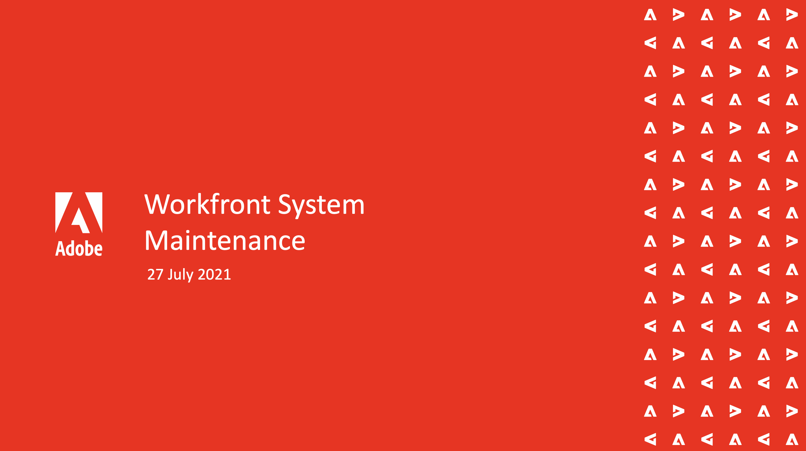

# Événements Workfront On-Demand {#overview}

Une bibliothèque d’événements Workfront enregistrés où experts et pairs partagent leurs réflexions sur l’utilisation de Workfront.

## Sessions en vedette

<table>
  <tr>
   <td>
      
      

         <a href="user-groups/workfront-system-maintenance.md"><strong>Maintenance du système Workfront</strong></a>
<!---          <em>foo</em> -->
      

      

         
         Un groupe d’administrateurs système discute des éléments à prendre en compte concernant la configuration du système, la maintenance régulière et le nettoyage.
      

    </td>
   <td>
      
      

         <a href="user-groups/reporting-and-dashboards.md"><strong>Rapports et tableaux de bord</strong></a>
<!---          <em>foo</em> -->
      

      

         
         Consultez les rapports et les tableaux de bord créés par d’autres pour leurs organisations et les bonnes pratiques qu’elles ont apprises.
      

    </td>
   <td>
      
      

         <a href="user-groups/agile-in-marketing.md"><strong>Agile dans le marketing</strong></a>
<!---          <em>foo</em> -->
      

      

         
         Des experts agiles discutent des points forts et des tendances qu'ils ont vus avec agilité, agilité générale dans les affaires, et comment ils utilisent Workfront pour agile.
      

    </td>
  </tr>
</table>
