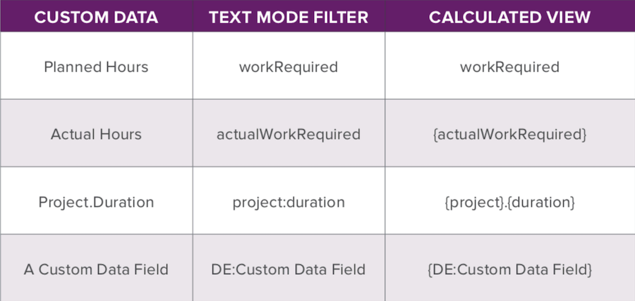

# Demandez à l’expert - Surchargez les rapports de mode de texte de base à l’aide de l’explorateur d’API.

Découvrez l’explorateur d’API, comment l’utiliser et comment améliorer vos rapports en utilisant le mode de texte de base. Ce webinaire a été enregistré le 22 janvier 2020.

>[!VIDEO](https://video.tv.adobe.com/v/341124/?quality=12)

## Ressources supplémentaires




**Colonne finale &quot;Tous les rôles de tâche&quot;**

```
description="Primary =" indicates the user's primary job role
displayname=All Job Roles
listdelimiter=<p>
listmethod=nested(userRoles).lists
textmode=true
type=iterate
valueexpression=IF({user}.{roleID}={role}.{ID},CONCAT("Primary = ",{role}.{name}),{role}.{name})
valueformat=HTML
```

**Mode texte de la colonne &quot;Toutes les équipes&quot;**

```
displayname=All Teams
listdelimiter=<p>
listmethod=nested(teams).lists
textmode=true
type=iterate
valueexpression={name}
valueformat=HTML
```

**Mode texte de la colonne &quot;Tous les groupes&quot;**

```
displayname=All Groups
listdelimiter=<p>
listmethod=nested(userGroups).lists
textmode=true
type=iterate
valuefield=group:name
valueformat=HTML
```

**Mode texte pour la colonne &quot;Rapports directs&quot;**

```
displayname=Direct Reports
listdelimiter=<p>
listmethod=nested(directReports).lists
textmode=true
type=iterate
valueexpression={name}
valueformat=HTML
```

## Q&amp;R

**Question**

Est-il possible d&#39;utiliser n&#39;importe quelle collection dans un rapport en mode texte ?

**Réponse**

Oui, vous pouvez utiliser n’importe quel objet dans la zone des collections. Vous voudrez explorer et voir ce à quoi vous avez accès. Tout le monde n’aura pas accès à l’objet utilisateur et à l’objet de rôle de tâche comme nous l’avons vu avec l’objet Rôles utilisateur dans l’explorateur d’API.

**Question**

Pouvez-vous discuter de &quot;l’utilisation conditionnelle de différentes collections dans la même colonne (mises à jour des projets ou mises à jour des tâches)&quot;

**Réponse**

Lorsque vous vous trouvez dans la zone d’itération et que vous y voyez le champ de valeur ou l’expression de valeur, vous accédez à l’un des éléments de votre liste de collections. En utilisant le champ de valeur, nous pouvons obtenir le nom de ce rôle de tâche, par exemple, ou tout ce qui se trouve dans cet élément de la liste. Si vous êtes dans une tâche, un objet de tâche peut référencer le projet dans lequel il se trouve.

**Question**

Pouvez-vous discuter si la &quot;collecte des mises à jour de tâche n’est possible que dans un rapport de tâche ?&quot;

**Réponse**

Lorsque vous créez un rapport de problème, vous pouvez voir les informations de la tâche si le problème a été signalé par rapport à la tâche, et vous pourrez également voir ces informations dans la collection. À l’exception de ces situations, vous devez figurer dans un rapport de tâche pour afficher les données de collecte de tâches.

**Question**

Peut-on partager le format Texte ([!DNL CSS]) des exemples ?

**Réponse**

Workfront ne prend pas en charge [!DNL CSS] en mode texte.

**Question**

Quelle est la méthode la plus efficace et la plus rapide pour localiser un nom de champ personnalisé, pour les rapports en mode texte ? J’ai utilisé l’option d’édition de HTML dans le navigateur OU en ajoutant un champ dans un rapport et en passant en mode texte pour l’attraper MAIS.. curieusement, comment les autres effectuent-ils cela ?

**Réponse**

Il est plus rapide de sélectionner le champ dans l’interface utilisateur, puis de passer en mode Texte et de copier le nom du champ. Cela permet d’obtenir l’orthographe correcte du champ.

**Question**

Comment puis-je utiliser le mode texte pour identifier les membres d’une équipe dans un rapport ? Nous utilisons actuellement des affectations d’équipe dans les workflows d’approbation de tâche et nous souhaitons répertorier les membres de l’équipe à l’étape d’approbation actuelle dans une colonne similaire au fonctionnement des champs Approbateurs et État .

**Réponse**

Pour référencer les membres de l’équipe associés à l’étape d’approbation actuelle, vous devez référencer une collection d’une collection référencée, ce qui n’est actuellement pas possible par le biais des fonctionnalités du mode texte Workfront. La colonne actuellement utilisée par votre organisation qui indique l’équipe associée à l’approbation est votre meilleure option.

**Question**

Le nom du champ et de l’objet doit-il être en bonne casse (par exemple, rôle ou rôle) ?

**Réponse**

Lorsque vous référencez des objets en mode texte, vous souhaiterez les écrire exactement comme le montre la colonne de droite de l’explorateur d’API. Par exemple, si vous souhaitez référencer un nom de projet à partir d’un rapport Tâche, votre champ de valeur se présente comme suit :

```
valuefield=project:name
```

Cependant, dans le cas des problèmes, ceux-ci sont appelés opTasks dans l’explorateur d’API. Ainsi, si vous exécutez un rapport Heure et souhaitez ajouter une colonne pour le nom du problème, le champ de valeur ressemblera à ce qui suit :

```
valuefield=opTask:name
```

**Question**

Je cherche à créer un rapport qui présente pour chaque projet la ou les principales tâches en cours de traitement. Comment ferais-je le mieux ? J’imagine qu’il s’agirait d’un rapport de tâche auquel s’ajouterait également des colonnes Informations sur le projet ?

**Réponse**

C&#39;est exact. Un rapport de tâche serait le mieux pour cela. Vous devez définir des &quot;Principales tâches&quot;. Si vous utilisez des prédécesseurs, il s’agit de tâches prêtes. Vous pouvez donc filtrer par Ready = True. Cela entraînerait toutes les tâches prêtes à démarrer. Je vous recommande ensuite de regrouper par nom de projet, de cette manière vos tâches sont toutes regroupées et vous pouvez voir en un coup d’oeil quelles tâches appartiennent au projet concerné.

**Question**

Existe-t-il un moyen de créer des rapports qui calculent les données, par exemple, % des projets qui répondent à certains critères ?

**Réponse**

La meilleure façon de créer un rapport pour présenter ou calculer des données (%, par exemple) consiste à appliquer des regroupements à votre rapport, puis à appliquer un graphique. Si vous deviez ajouter un graphique circulaire à votre rapport, vous avez la possibilité que les tranches soient en valeurs ou en pourcentages.

**Question**

Pouvez-vous utiliser le mode texte pour identifier les membres d’une équipe affectés à l’étape d’approbation actuelle de la tâche, comme dans la colonne Approbateurs et état ?

**Réponse**

Vous devez ajouter une colonne de collection en mode texte à votre rapport Tâche avec les éléments suivants :

```
displayname=Current Approval Stage Approvers 
listdelimiter=<p> 
listmethod=nested(currentApprovalStep.stepApprovers).lists 
textmode=true
type=iterate 
valuefield=user:name 
valueformat=HTML
```

**Question**

Êtes-vous en mesure de filtrer l’emplacement où Tous les groupes contiennent un groupe particulier ?

**Réponse**

Si vous souhaitez filtrer les éléments de votre rapport, vous pouvez le faire dans l’onglet de filtrage de votre rapport. Ainsi, si vous souhaitez afficher uniquement les utilisateurs dont l’un de leurs groupes était Comptabilisation, vous ajoutez une règle de filtre qui dit :

```
Other Groups>ID>Equal>Accounting
```

**Question**

Existe-t-il un moyen de créer un rapport qui détermine la durée réelle d’une combinaison de tâches ?

**Réponse**

Vous devez filtrer votre rapport pour n’inclure que la combinaison de tâches souhaitée. Vous devez ensuite mettre une colonne Durée réelle dans votre vue et la résumer par Somme dans les Paramètres de colonne. Enfin, vous devez regrouper votre rapport d&#39;une manière ou d&#39;une autre. Lors de l&#39;exécution du rapport, la barre de groupement affiche le total des durées réelles contenues dans les lignes regroupées.

**Question**

Existe-t-il un moyen de soustraire les tâches qui tombent sous un parent pour déterminer la durée du reste des tâches sous un parent ?

**Réponse**

La durée d’une tâche parent est calculée en soustrayant la date de début de la tâche commençant la plus tôt à la date de fin de la dernière tâche de fin sous ce parent. Dans un rapport, vous ne connaissez que chaque tâche qui est prise en compte pour déterminer si elle doit être affichée ou non. Le moteur de rapports ne permet pas de se connecter aux informations d’une tâche et de les utiliser lors de l’affichage d’une autre tâche. La seule façon d’accomplir ce que vous demandez est de supprimer une tâche d’un parent spécifique lors de l’affichage dans la liste des tâches du projet et d’observer comment la durée de la tâche parent est recalculée.

**Question**

Pour les regroupements conditionnels, un formulaire personnalisé (pensez &quot;États occidentaux&quot;, &quot;États centraux&quot;, &quot;États de l’Est&quot;) pour décoder les différents groupes est une technique courante qui fonctionne bien sur cette note, quand vous préférez utiliser des regroupements calculés plutôt que des paramètres calculés ?

**Réponse**

Les groupements calculés (c’est-à-dire une expression de valeur dans un groupement) sont un moyen pratique d’afficher un résultat dans la barre de groupement. Vous pouvez également utiliser un champ personnalisé calculé. Chaque approche présente des avantages et des inconvénients, à savoir :

* Les expressions de valeur sont calculées chaque fois que la page de votre navigateur est actualisée. Cela peut être préférable à des champs personnalisés calculés qui sont recalculés chaque fois que l’objet auquel ils sont attachés est modifié, ou lorsque les champs calculés sont recalculés dans une modification en masse, ou lorsque le formulaire personnalisé est modifié et que l’option &quot;Mettre à jour les calculs précédents&quot; est sélectionnée.
* Toutefois, les expressions de valeur ne peuvent pas être utilisées dans les graphiques, la mise en forme conditionnelle ou le filtre. Vous devrez utiliser des champs personnalisés calculés pour ces éléments.

**Question**

N’est-il pas possible de modifier le nom d’affichage du groupement de &quot;Aucune valeur&quot; en tout autre nom que nous choisissons d’appeler à des fins de création de rapports ? en d’autres termes, il s’agira TOUJOURS de &quot;aucune valeur&quot; ?

**Réponse**

Il existe un moyen de remplacer &quot;Aucune valeur&quot; par quelque chose de différent. Supposons qu’un rapport de projet soit regroupé par nom de Portfolio. Tous les projets qui ne sont pas affectés à un portefeuille se retrouvent dans un groupe avec le titre :

```
Portfolio: Name: No Value
```

Pour changer cela, éditez le groupement en mode texte et remplacez cette ligne :

```
group.0.valuefield=portfolio:name
```

avec cette ligne :

```
group.0.valueexpression=IF(ISBLANK({portfolio}.{name}),"Not in any Portfolio",{portfolio}.{name})
```

Le groupement aura désormais le titre suivant :

```
Portfolio: Name: Not in any Portfolio
```

**Question**

Existe-t-il un paramètre pour suivre les affectations incomplètes, à savoir :

1. Tâches avec une seule affectation auxquelles aucune personne n’a été affectée ou
1. Tâches avec plusieurs affectations qui ont au moins une personne non affectée pour les rôles demandés

**Réponse**

Pour ce faire, utilisez un rapport d’affectation et filtrez pour

```
Assigned To ID > Is Blank and Role ID > Is Not Blank
```

Cela permet d’extraire toutes les tâches ou tous les problèmes qui ont été affectés à un rôle, mais pas nécessairement un utilisateur spécifique. Vous devrez ajouter les colonnes pour le nom de la tâche et du problème pour voir à quel objet appartient l’affectation. Si vous les rassemblez par nom du projet, cela contribuera à le maintenir organisé.

**Question**

Chuck, je suis en train d&#39;oublier, mais vous rappelez-vous la propriété en mode texte qui s&#39;affichera alors sous forme d&#39;info-bulle, au survol ?

**Réponse**

description= vous permet d’afficher une info-bulle lorsque vous placez le pointeur de la souris sur l’en-tête de colonne.

**Question**

Puis-je créer un rapport à partir d’un champ de case à cocher qui permet plusieurs sélections, mais uniquement d’extraire la première sélection dans le rapport ?

**Réponse**

Oui. Les options sélectionnées dans le champ de case à cocher sont toutes dans une chaîne, chaque sélection étant séparée par une virgule. Vous allez utiliser l’expression RECHERCHE pour trouver la position de la première virgule dans le champ de case à cocher, puis utiliser cet index avec l’expression GAUCHE pour afficher autant de caractères que vous le souhaitez depuis le début de la liste. Voici le code :

```
valueexpression=IF(SEARCH(",",{DE:Checkbox Field},0)>0,LEFT({DE:Checkbox Field},SEARCH(",",{DE:Checkbox Field},0)),{DE:Checkbox Field})
```

Si vous utilisez une virgule dans le nom d’une sélection dans votre champ de case à cocher, seule la partie de cette sélection s’affichera jusqu’à la première virgule.
